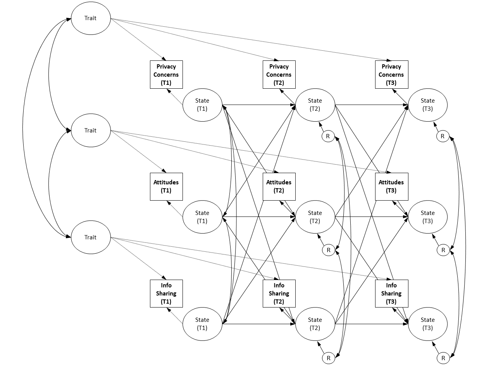

```{r, echo=F, include=F}
# defaults
set.seed(170819)
options(digits=3, width=120, max.print=100000)
knitr::opts_chunk$set(echo=T, error=F, message=F, tidy=T, warning=F, cache=T)
```

```{r Packages, cache=F, results='hide'}
# relevant packages
devtools::install_github("tdienlin/td@v.0.0.2.5")
required <- c("GGally", "ggplot2", "lavaan", "lme4", "magrittr", 
              "MissMech", "papaja", "psych", "pwr", "MVN", "semTools", 
              "sjstats", "tidyverse", "td")

# load required libraries
lapply(required, function(x) library(x, character.only = T))

# export bib library
r_refs("bibliography/r-references.bib")

# first run "data_wranling.R", in order to create these objects
d_wide <- read_csv("data/data_wide.csv")
d_wide_all <- read_csv("data/data_wide_all.csv")
d_long <- read_csv("data/data_long.csv")

# Extract descriptives to report in paper
desc <- d_wide %>% 
  summarize_at(vars(ends_with("_m")), funs(mean(., na.rm = TRUE), sd(., na.rm = TRUE)))
```

# Items
## Privacy Concern

The following deals with things that can happen on the Internet.

1. In general, how concerned are you about your privacy while using the Internet?
2. Are you concerned about online organizations not being who they claim they are?
3. Are you concerned about online identity theft?
4. Are you concerned about people you do not know obtaining personal information about you from your online activities?
5. Are you concerned that if you use your credit card to buy something on the Internet your credit card number will be obtained/intercepted by someone else?
6. Are you concerned that an email you sent may be read by someone else besides the person you sent it to?
7. Are you concerned that institutions or secret services could collect and analyze the data that you are disclosing on the Internet?
8. Are you concerned that website providers are tracking your online activities?
9. Are you concerned that you don’t know what other organizations or website providers are doing with you data?

(NA = "no Internet user / no reply", 1 = "Not concerned at all" : 5 = "very concerned")

## Attitude Toward Online Sharing of Personal Information

Now we will deal with information sharing on the Internet. Do you think that it is sensible to disclose the following pieces of information online, i.e., via the Internet?

1. Financial information (bank data, account balances…)
2. Medical information (health, medical records…)
3. Second name
4. First name
5. Residence
6. Street and house number
7. Email address
8. Phone number
9. Photos (of you)
10. Job (past and present)
11. Education

(NA = “no Internet user / no reply”, 1 = "not sensible at all", 2 = "somewhat not sensible", 3 = "in part", 4 = "somewhat sensible", 5 = "very sensible")

## Online Sharing of Personal Information

In the following, please indicate how often you disclose the following information on the Internet. How often do you disclose the following pieces of information online, i.e., on the Internet?

1. Financial information (bank data, account balances…)
2. Medical information (health, medical records…)
3. Second name
4. First name
5. Residence
6. Street and house number
7. Email address
8. Phone number
9. Photos (of you)
10. Job (past and present)
11. Education

(NA = “no Internet user / no reply”, 1 = "every day", 2 = "weekly", 3 = "monthly", 4 = "less than that", 5 = "never")

# Power Analyses

```{r power}
n_complete <- nrow(d_wide)
alpha <- .05
power <- .95
sesoi <- .1
n <- n_complete
n_apriori <- pwr.r.test(r = sesoi, sig.level = alpha, power = power)$n
power_achieved_h <- pwr.r.test(r = sesoi, sig.level = alpha, n = n, alternative = "greater")$power
alpha_balanced_h <- balance_errors(sesoi, n, one_tailed = TRUE)
power_balanced_h <- 1 - alpha_balanced_h
power_achieved_rq <- pwr.r.test(r = sesoi, sig.level = alpha, n = n)$power
alpha_balanced_rq <- balance_errors(sesoi, n, one_tailed = FALSE)
power_balanced_rq <- 1 - alpha_balanced_rq
```

A-priori power analyses revealed that N = `r n_apriori` people would be needed to find effects with a size of _r_ = `r sesoi` with a power of `r power`.

Overall, the data of `r n` respondents could be used for our analyses. As a result, alpha and beta errors were balanced when using an alpha of `r alpha_balanced_h %>% round(3)`, resulting in an achieved power of `r power_balanced_h %>% round(3)`.

# Sociodemographics

```{r}
age_m <- mean(d_wide$age)
age_sd <- sd(d_wide$age)
male_per <- mean(d_wide$male)
edu_col_per <- nrow(d_wide[d_wide$edu_num > 5, ]) / n_complete * 100
```

# Analysis of Missing Values

```{r cache=F}
d_tmp <- select(d_wide, -contains("_m"), -contains("tim"), -contains("T4"), -contains("T5"), -contains("per"), -contains("use"), -c(id, age, edu, edu_num, male))
test_mar <- TestMCARNormality(d_tmp)

# print patterns
as.data.frame(test_mar$patused)

# non-parametric test
(test_mar_p <- test_mar$pnormality)

# calculate percentage of missing data
na_per <- mean(c(d_wide$t1_na_per, d_wide$t2_na_per, d_wide$t3_na_per)) * 100
```

Visual inspection of the missing value patterns as well as the non-parametric test suggested that all missing values could be considered to be missing at random (_p_ `r test_mar$pnormality %>% td::my_round("p_txt")`).

# Factor Analyses
## Concerns about online privacy
### EFA

```{r}
# set-up
no <- 0
name <- "pri_con"
d_tmp <- select(d_wide, contains(paste0("t1_", name)), -contains("_m"))
model <- fa.parallel(d_tmp, fa = "fa", fm = "ml")
factan <- fa(d_tmp, fm = "ml", nfactors = model$nfact, rotate = "promax")
print(factan, sort = TRUE, cut = .3)
```

### CFA
#### First-Order Model Unconstrained

```{r}
model <- '
# create factors
t1_pri_con_f =~ 1*t1_pri_con_01 + t1_pri_con_02 + t1_pri_con_03 + t1_pri_con_04 + t1_pri_con_05 + t1_pri_con_06 + t1_pri_con_07 + t1_pri_con_08 + t1_pri_con_09
t2_pri_con_f =~ 1*t2_pri_con_01 + t2_pri_con_02 + t2_pri_con_03 + t2_pri_con_04 + t2_pri_con_05 + t2_pri_con_06 + t2_pri_con_07 + t2_pri_con_08 + t2_pri_con_09
t3_pri_con_f =~ 1*t3_pri_con_01 + t3_pri_con_02 + t3_pri_con_03 + t3_pri_con_04 + t3_pri_con_05 + t3_pri_con_06 + t3_pri_con_07 + t3_pri_con_08 + t3_pri_con_09

# error covariances
t3_pri_con_01 ~~ t2_pri_con_01 + t1_pri_con_01
t3_pri_con_02 ~~ t2_pri_con_02 + t1_pri_con_02
t3_pri_con_03 ~~ t2_pri_con_03 + t1_pri_con_03
t3_pri_con_04 ~~ t2_pri_con_04 + t1_pri_con_04
t3_pri_con_05 ~~ t2_pri_con_05 + t1_pri_con_05
t3_pri_con_06 ~~ t2_pri_con_06 + t1_pri_con_06
t3_pri_con_07 ~~ t2_pri_con_07 + t1_pri_con_07
t3_pri_con_08 ~~ t2_pri_con_08 + t1_pri_con_08
t3_pri_con_09 ~~ t2_pri_con_09 + t1_pri_con_09
t2_pri_con_01 ~~ t1_pri_con_01
t2_pri_con_02 ~~ t1_pri_con_02 
t2_pri_con_03 ~~ t1_pri_con_03
t2_pri_con_04 ~~ t1_pri_con_04
t2_pri_con_05 ~~ t1_pri_con_05 
t2_pri_con_06 ~~ t1_pri_con_06
t2_pri_con_07 ~~ t1_pri_con_07
t2_pri_con_08 ~~ t1_pri_con_08
t2_pri_con_09 ~~ t1_pri_con_09

# factor covariances
t1_pri_con_f ~~ t2_pri_con_f + t3_pri_con_f
t2_pri_con_f ~~ t3_pri_con_f
'
no <- no + 1
assign(paste("fit", name, no, sep = "_"), cfa(model, d_wide, missing = "ML"))
summary(get(paste("fit", name, no, sep = "_")), standardized = TRUE, fit.measures = TRUE)
reliability(get(paste("fit", name, no, sep = "_")))
```

#### First-Order Model Constrained

```{r}
model <- '
# create factors
t1_pri_con_f =~ 1*t1_pri_con_01 + b2*t1_pri_con_02 + b3*t1_pri_con_03 + b4*t1_pri_con_04 + b5*t1_pri_con_05 + b6*t1_pri_con_06 + b7*t1_pri_con_07 + b8*t1_pri_con_08 + b9*t1_pri_con_09
t2_pri_con_f =~ 1*t2_pri_con_01 + b2*t2_pri_con_02 + b3*t2_pri_con_03 + b4*t2_pri_con_04 + b5*t2_pri_con_05 + b6*t2_pri_con_06 + b7*t2_pri_con_07 + b8*t2_pri_con_08 + b9*t2_pri_con_09
t3_pri_con_f =~ 1*t3_pri_con_01 + b2*t3_pri_con_02 + b3*t3_pri_con_03 + b4*t3_pri_con_04 + b5*t3_pri_con_05 + b6*t3_pri_con_06 + b7*t3_pri_con_07 + b8*t3_pri_con_08 + b9*t3_pri_con_09

# error covariances
t3_pri_con_01 ~~ t2_pri_con_01 + t1_pri_con_01
t3_pri_con_02 ~~ t2_pri_con_02 + t1_pri_con_02
t3_pri_con_03 ~~ t2_pri_con_03 + t1_pri_con_03
t3_pri_con_04 ~~ t2_pri_con_04 + t1_pri_con_04
t3_pri_con_05 ~~ t2_pri_con_05 + t1_pri_con_05
t3_pri_con_06 ~~ t2_pri_con_06 + t1_pri_con_06
t3_pri_con_07 ~~ t2_pri_con_07 + t1_pri_con_07
t3_pri_con_08 ~~ t2_pri_con_08 + t1_pri_con_08
t3_pri_con_09 ~~ t2_pri_con_09 + t1_pri_con_09
t2_pri_con_01 ~~ t1_pri_con_01
t2_pri_con_02 ~~ t1_pri_con_02 
t2_pri_con_03 ~~ t1_pri_con_03
t2_pri_con_04 ~~ t1_pri_con_04
t2_pri_con_05 ~~ t1_pri_con_05 
t2_pri_con_06 ~~ t1_pri_con_06
t2_pri_con_07 ~~ t1_pri_con_07
t2_pri_con_08 ~~ t1_pri_con_08
t2_pri_con_09 ~~ t1_pri_con_09

# factor covariances
t1_pri_con_f ~~ t2_pri_con_f + t3_pri_con_f
t2_pri_con_f ~~ t3_pri_con_f
'
no <- no + 1
assign(paste("fit", name, no, sep = "_"), cfa(model, d_wide, missing = "ML"))
summary(get(paste("fit", name, no, sep = "_")), standardized = TRUE, fit.measures = TRUE)
```

#### Second-Order Model Unconstrained

In what follows, we analyze a second-order solution of privacy concerns. Here, we distinguish between horizontal privacy concerns (items 4, 5, 6) and vertical privacy concerns (items 7, 8, 9). The resulting model fits the data better than the unidimensional one.

```{r}
model <- '
# create factors
t1_pri_con_f =~ 1*t1_pri_con_f1 + t1_pri_con_f2
t2_pri_con_f =~ 1*t2_pri_con_f1 + t2_pri_con_f2
t3_pri_con_f =~ 1*t3_pri_con_f1 + t3_pri_con_f2
t1_pri_con_f1 =~ 1*t1_pri_con_04 + t1_pri_con_05 + t1_pri_con_06
t1_pri_con_f2 =~ 1*t1_pri_con_07 + t1_pri_con_08 + t1_pri_con_09
t2_pri_con_f1 =~ 1*t2_pri_con_04 + t2_pri_con_05 + t2_pri_con_06
t2_pri_con_f2 =~ 1*t2_pri_con_07 + t2_pri_con_08 + t2_pri_con_09
t3_pri_con_f1 =~ 1*t3_pri_con_04 + t3_pri_con_05 + t3_pri_con_06
t3_pri_con_f2 =~ 1*t3_pri_con_07 + t3_pri_con_08 + t3_pri_con_09

# error covariances
t3_pri_con_04 ~~ t2_pri_con_04 + t1_pri_con_04
t3_pri_con_05 ~~ t2_pri_con_05 + t1_pri_con_05
t3_pri_con_06 ~~ t2_pri_con_06 + t1_pri_con_06
t3_pri_con_07 ~~ t2_pri_con_07 + t1_pri_con_07
t3_pri_con_08 ~~ t2_pri_con_08 + t1_pri_con_08
t3_pri_con_09 ~~ t2_pri_con_09 + t1_pri_con_09
t2_pri_con_04 ~~ t1_pri_con_04
t2_pri_con_05 ~~ t1_pri_con_05 
t2_pri_con_06 ~~ t1_pri_con_06
t2_pri_con_07 ~~ t1_pri_con_07
t2_pri_con_08 ~~ t1_pri_con_08
t2_pri_con_09 ~~ t1_pri_con_09

# factor covariances
t1_pri_con_f ~~ t2_pri_con_f + t3_pri_con_f
t2_pri_con_f ~~ t3_pri_con_f
'
no <- no + 1
assign(paste("fit", name, no, sep = "_"), cfa(model, d_wide, missing = "ML"))
summary(get(paste("fit", name, no, sep = "_")), standardized = TRUE, fit.measures = TRUE)
``` 

#### Second-Order Model Constrained

```{r}
model <- '
# create factors
t1_pri_con_f =~ 1*t1_pri_con_f1 + a2*t1_pri_con_f2
t2_pri_con_f =~ 1*t2_pri_con_f1 + a2*t2_pri_con_f2
t3_pri_con_f =~ 1*t3_pri_con_f1 + a2*t3_pri_con_f2
t1_pri_con_f1 =~ 1*t1_pri_con_04 + b2*t1_pri_con_05 + b3*t1_pri_con_06
t1_pri_con_f2 =~ 1*t1_pri_con_07 + c2*t1_pri_con_08 + c3*t1_pri_con_09
t2_pri_con_f1 =~ 1*t2_pri_con_04 + b2*t2_pri_con_05 + b3*t2_pri_con_06
t2_pri_con_f2 =~ 1*t2_pri_con_07 + c2*t2_pri_con_08 + c3*t2_pri_con_09
t3_pri_con_f1 =~ 1*t3_pri_con_04 + b2*t3_pri_con_05 + b3*t3_pri_con_06
t3_pri_con_f2 =~ 1*t3_pri_con_07 + c2*t3_pri_con_08 + c3*t3_pri_con_09

# error covariances
t3_pri_con_04 ~~ t2_pri_con_04 + t1_pri_con_04
t3_pri_con_05 ~~ t2_pri_con_05 + t1_pri_con_05
t3_pri_con_06 ~~ t2_pri_con_06 + t1_pri_con_06
t3_pri_con_07 ~~ t2_pri_con_07 + t1_pri_con_07
t3_pri_con_08 ~~ t2_pri_con_08 + t1_pri_con_08
t3_pri_con_09 ~~ t2_pri_con_09 + t1_pri_con_09
t2_pri_con_04 ~~ t1_pri_con_04
t2_pri_con_05 ~~ t1_pri_con_05 
t2_pri_con_06 ~~ t1_pri_con_06
t2_pri_con_07 ~~ t1_pri_con_07
t2_pri_con_08 ~~ t1_pri_con_08
t2_pri_con_09 ~~ t1_pri_con_09

# factor covariances
t1_pri_con_f ~~ t2_pri_con_f + t3_pri_con_f
t2_pri_con_f ~~ t3_pri_con_f
'
no <- no + 1
assign(paste("fit", name, no, sep = "_"), cfa(model, d_wide, missing = "ML"))
summary(get(paste("fit", name, no, sep = "_")), standardized = TRUE, fit.measures = TRUE)
```

### Reliability

```{r}
reliabilityL2(get(paste("fit", name, no, sep = "_")), paste("t1", name, "f", sep = "_"))
reliabilityL2(get(paste("fit", name, no, sep = "_")), paste("t2", name, "f", sep = "_"))
reliabilityL2(get(paste("fit", name, no, sep = "_")), paste("t3", name, "f", sep = "_"))
```

### Longitudinal Invariance

```{r}
(anova(get(paste("fit", name, no - 1, sep = "_")), get(paste("fit", name, no, sep = "_"))))
```

## Attitude Toward Online Sharing of Personal Information
### EFA

```{r}
no <- 0
name <- "inf_sha_att"
d_tmp <- select(d_wide, contains(paste0("t1_", name)), -contains("_m"))
model <- fa.parallel(d_tmp, fa = "fa", fm = "ml")
factan <- fa(d_tmp, fm = "ml", nfactors = model$nfact, rotate = "promax")
print(factan, sort = TRUE, cut = .3)
```

### CFA
#### First-Order Model Unconstrained

```{r}
model <- '
# create factors
t1_pri_con_f =~ 1*t1_pri_con_01 + t1_pri_con_02 + t1_pri_con_03 + t1_pri_con_04 + t1_pri_con_05 + t1_pri_con_06 + t1_pri_con_07 + t1_pri_con_08 + t1_pri_con_09
t2_pri_con_f =~ 1*t2_pri_con_01 + t2_pri_con_02 + t2_pri_con_03 + t2_pri_con_04 + t2_pri_con_05 + t2_pri_con_06 + t2_pri_con_07 + t2_pri_con_08 + t2_pri_con_09
t3_pri_con_f =~ 1*t3_pri_con_01 + t3_pri_con_02 + t3_pri_con_03 + t3_pri_con_04 + t3_pri_con_05 + t3_pri_con_06 + t3_pri_con_07 + t3_pri_con_08 + t3_pri_con_09

# error covariances
t3_pri_con_01 ~~ t2_pri_con_01 + t1_pri_con_01
t3_pri_con_02 ~~ t2_pri_con_02 + t1_pri_con_02
t3_pri_con_03 ~~ t2_pri_con_03 + t1_pri_con_03
t3_pri_con_04 ~~ t2_pri_con_04 + t1_pri_con_04
t3_pri_con_05 ~~ t2_pri_con_05 + t1_pri_con_05
t3_pri_con_06 ~~ t2_pri_con_06 + t1_pri_con_06
t3_pri_con_07 ~~ t2_pri_con_07 + t1_pri_con_07
t3_pri_con_08 ~~ t2_pri_con_08 + t1_pri_con_08
t3_pri_con_09 ~~ t2_pri_con_09 + t1_pri_con_09
t2_pri_con_01 ~~ t1_pri_con_01
t2_pri_con_02 ~~ t1_pri_con_02 
t2_pri_con_03 ~~ t1_pri_con_03
t2_pri_con_04 ~~ t1_pri_con_04
t2_pri_con_05 ~~ t1_pri_con_05 
t2_pri_con_06 ~~ t1_pri_con_06
t2_pri_con_07 ~~ t1_pri_con_07
t2_pri_con_08 ~~ t1_pri_con_08
t2_pri_con_09 ~~ t1_pri_con_09

# factor covariances
t1_pri_con_f ~~ t2_pri_con_f + t3_pri_con_f
t2_pri_con_f ~~ t3_pri_con_f
'
no <- no + 1
assign(paste("fit", name, no, sep = "_"), cfa(model, d_wide, missing = "ML"))
summary(get(paste("fit", name, no, sep = "_")), standardized = TRUE, fit.measures = TRUE)
```

#### First-Order Model Constrained

```{r}
model <- '
# create factors
t1_pri_con_f =~ 1*t1_pri_con_01 + a2*t1_pri_con_02 + a3*t1_pri_con_03 + a4*t1_pri_con_04 + a5*t1_pri_con_05 + a6*t1_pri_con_06 + a7*t1_pri_con_07 + a8*t1_pri_con_08 + a9*t1_pri_con_09
t2_pri_con_f =~ 1*t2_pri_con_01 + a2*t2_pri_con_02 + a3*t2_pri_con_03 + a4*t2_pri_con_04 + a5*t2_pri_con_05 + a6*t2_pri_con_06 + a7*t2_pri_con_07 + a8*t2_pri_con_08 + a9*t2_pri_con_09
t3_pri_con_f =~ 1*t3_pri_con_01 + a2*t3_pri_con_02 + a3*t3_pri_con_03 + a4*t3_pri_con_04 + a5*t3_pri_con_05 + a6*t3_pri_con_06 + a7*t3_pri_con_07 + a8*t3_pri_con_08 + a9*t3_pri_con_09

# error covariances
t3_pri_con_01 ~~ t2_pri_con_01 + t1_pri_con_01
t3_pri_con_02 ~~ t2_pri_con_02 + t1_pri_con_02
t3_pri_con_03 ~~ t2_pri_con_03 + t1_pri_con_03
t3_pri_con_04 ~~ t2_pri_con_04 + t1_pri_con_04
t3_pri_con_05 ~~ t2_pri_con_05 + t1_pri_con_05
t3_pri_con_06 ~~ t2_pri_con_06 + t1_pri_con_06
t3_pri_con_07 ~~ t2_pri_con_07 + t1_pri_con_07
t3_pri_con_08 ~~ t2_pri_con_08 + t1_pri_con_08
t3_pri_con_09 ~~ t2_pri_con_09 + t1_pri_con_09
t2_pri_con_01 ~~ t1_pri_con_01
t2_pri_con_02 ~~ t1_pri_con_02 
t2_pri_con_03 ~~ t1_pri_con_03
t2_pri_con_04 ~~ t1_pri_con_04
t2_pri_con_05 ~~ t1_pri_con_05 
t2_pri_con_06 ~~ t1_pri_con_06
t2_pri_con_07 ~~ t1_pri_con_07
t2_pri_con_08 ~~ t1_pri_con_08
t2_pri_con_09 ~~ t1_pri_con_09

# factor covariances
t1_pri_con_f ~~ t2_pri_con_f + t3_pri_con_f
t2_pri_con_f ~~ t3_pri_con_f
'
no <- no + 1
assign(paste("fit", name, no, sep = "_"), cfa(model, d_wide, missing = "ML"))
summary(get(paste("fit", name, no, sep = "_")), standardized = TRUE, fit.measures = TRUE)
```

#### Second-Order Model Unconstrained

We again run models in which we build sub-dimensions referring to the empirical EFA results and theoretical considerations. Resulting model fits the data better than unidimensional one.

```{r}
model <- '
# create factors
t1_inf_sha_att_f =~ 1*t1_inf_sha_att_f1 + t1_inf_sha_att_f2 + t1_inf_sha_att_f3 + t1_inf_sha_att_f4 + t1_inf_sha_att_f5
t2_inf_sha_att_f =~ 1*t2_inf_sha_att_f1 + t2_inf_sha_att_f2 + t2_inf_sha_att_f3 + t2_inf_sha_att_f4 + t2_inf_sha_att_f5
t3_inf_sha_att_f =~ 1*t3_inf_sha_att_f1 + t3_inf_sha_att_f2 + t3_inf_sha_att_f3 + t3_inf_sha_att_f4 + t3_inf_sha_att_f5
t1_inf_sha_att_f1 =~ 1*t1_inf_sha_att_01 + t1_inf_sha_att_02
t1_inf_sha_att_f2 =~ 1*t1_inf_sha_att_03 + t1_inf_sha_att_04
t1_inf_sha_att_f3 =~ 1*t1_inf_sha_att_05 + t1_inf_sha_att_06
t1_inf_sha_att_f4 =~ 1*t1_inf_sha_att_07 + t1_inf_sha_att_08
t1_inf_sha_att_f5 =~ 1*t1_inf_sha_att_10 + t1_inf_sha_att_11
t2_inf_sha_att_f1 =~ 1*t2_inf_sha_att_01 + t2_inf_sha_att_02
t2_inf_sha_att_f2 =~ 1*t2_inf_sha_att_03 + t2_inf_sha_att_04
t2_inf_sha_att_f3 =~ 1*t2_inf_sha_att_05 + t2_inf_sha_att_06
t2_inf_sha_att_f4 =~ 1*t2_inf_sha_att_07 + t2_inf_sha_att_08
t2_inf_sha_att_f5 =~ 1*t2_inf_sha_att_10 + t2_inf_sha_att_11
t3_inf_sha_att_f1 =~ 1*t3_inf_sha_att_01 + t3_inf_sha_att_02
t3_inf_sha_att_f2 =~ 1*t3_inf_sha_att_03 + t3_inf_sha_att_04
t3_inf_sha_att_f3 =~ 1*t3_inf_sha_att_05 + t3_inf_sha_att_06
t3_inf_sha_att_f4 =~ 1*t3_inf_sha_att_07 + t3_inf_sha_att_08
t3_inf_sha_att_f5 =~ 1*t3_inf_sha_att_10 + t3_inf_sha_att_11

# factor covariance
t1_inf_sha_att_f ~~ t2_inf_sha_att_f + t3_inf_sha_att_f
t2_inf_sha_att_f ~~ t3_inf_sha_att_f

# item error covariance
t1_inf_sha_att_01 ~~ t2_inf_sha_att_01 + t3_inf_sha_att_01
t2_inf_sha_att_01 ~~ t3_inf_sha_att_01
t1_inf_sha_att_02 ~~ t2_inf_sha_att_02 + t3_inf_sha_att_02
t2_inf_sha_att_02 ~~ t3_inf_sha_att_02
t1_inf_sha_att_03 ~~ t2_inf_sha_att_03 + t3_inf_sha_att_03
t2_inf_sha_att_03 ~~ t3_inf_sha_att_03
t1_inf_sha_att_04 ~~ t2_inf_sha_att_04 + t3_inf_sha_att_04
t2_inf_sha_att_04 ~~ t3_inf_sha_att_04
t1_inf_sha_att_05 ~~ t2_inf_sha_att_05 + t3_inf_sha_att_05
t2_inf_sha_att_05 ~~ t3_inf_sha_att_05
t1_inf_sha_att_06 ~~ t2_inf_sha_att_06 + t3_inf_sha_att_06
t2_inf_sha_att_06 ~~ t3_inf_sha_att_06
t1_inf_sha_att_07 ~~ t2_inf_sha_att_07 + t3_inf_sha_att_07
t2_inf_sha_att_07 ~~ t3_inf_sha_att_07
t1_inf_sha_att_08 ~~ t2_inf_sha_att_08 + t3_inf_sha_att_08
t2_inf_sha_att_08 ~~ t3_inf_sha_att_08
t1_inf_sha_att_10 ~~ t2_inf_sha_att_10 + t3_inf_sha_att_10
t2_inf_sha_att_10 ~~ t3_inf_sha_att_10
t1_inf_sha_att_11 ~~ t2_inf_sha_att_11 + t3_inf_sha_att_11
t2_inf_sha_att_11 ~~ t3_inf_sha_att_11
'
no <- no + 1
assign(paste("fit", name, no, sep = "_"), cfa(model, d_wide, missing = "ML"))
summary(get(paste("fit", name, no, sep = "_")), standardized = TRUE, fit.measures = TRUE)
```

#### Second-Order Model at All Waves Constrained

```{r}
model <- '
# create factors
t1_inf_sha_att_f =~ 1*t1_inf_sha_att_f1 + o2*t1_inf_sha_att_f2 + o3*t1_inf_sha_att_f3 + o4*t1_inf_sha_att_f4 + o5*t1_inf_sha_att_f5
t2_inf_sha_att_f =~ 1*t2_inf_sha_att_f1 + o2*t2_inf_sha_att_f2 + o3*t2_inf_sha_att_f3 + o4*t2_inf_sha_att_f4 + o5*t2_inf_sha_att_f5
t3_inf_sha_att_f =~ 1*t3_inf_sha_att_f1 + o2*t3_inf_sha_att_f2 + o3*t3_inf_sha_att_f3 + o4*t3_inf_sha_att_f4 + o5*t3_inf_sha_att_f5
t1_inf_sha_att_f1 =~ 1*t1_inf_sha_att_01 + j2*t1_inf_sha_att_02
t1_inf_sha_att_f2 =~ 1*t1_inf_sha_att_03 + k2*t1_inf_sha_att_04
t1_inf_sha_att_f3 =~ 1*t1_inf_sha_att_05 + l2*t1_inf_sha_att_06
t1_inf_sha_att_f4 =~ 1*t1_inf_sha_att_07 + m2*t1_inf_sha_att_08
t1_inf_sha_att_f5 =~ 1*t1_inf_sha_att_10 + n2*t1_inf_sha_att_11
t2_inf_sha_att_f1 =~ 1*t2_inf_sha_att_01 + j2*t2_inf_sha_att_02
t2_inf_sha_att_f2 =~ 1*t2_inf_sha_att_03 + k2*t2_inf_sha_att_04
t2_inf_sha_att_f3 =~ 1*t2_inf_sha_att_05 + l2*t2_inf_sha_att_06
t2_inf_sha_att_f4 =~ 1*t2_inf_sha_att_07 + m2*t2_inf_sha_att_08
t2_inf_sha_att_f5 =~ 1*t2_inf_sha_att_10 + n2*t2_inf_sha_att_11
t3_inf_sha_att_f1 =~ 1*t3_inf_sha_att_01 + j2*t3_inf_sha_att_02
t3_inf_sha_att_f2 =~ 1*t3_inf_sha_att_03 + k2*t3_inf_sha_att_04
t3_inf_sha_att_f3 =~ 1*t3_inf_sha_att_05 + l2*t3_inf_sha_att_06
t3_inf_sha_att_f4 =~ 1*t3_inf_sha_att_07 + m2*t3_inf_sha_att_08
t3_inf_sha_att_f5 =~ 1*t3_inf_sha_att_10 + n2*t3_inf_sha_att_11

# factor covariance
t1_inf_sha_att_f ~~ t2_inf_sha_att_f + t3_inf_sha_att_f
t2_inf_sha_att_f ~~ t3_inf_sha_att_f

# item error covariance
t1_inf_sha_att_01 ~~ t2_inf_sha_att_01 + t3_inf_sha_att_01
t2_inf_sha_att_01 ~~ t3_inf_sha_att_01
t1_inf_sha_att_02 ~~ t2_inf_sha_att_02 + t3_inf_sha_att_02
t2_inf_sha_att_02 ~~ t3_inf_sha_att_02
t1_inf_sha_att_03 ~~ t2_inf_sha_att_03 + t3_inf_sha_att_03
t2_inf_sha_att_03 ~~ t3_inf_sha_att_03
t1_inf_sha_att_04 ~~ t2_inf_sha_att_04 + t3_inf_sha_att_04
t2_inf_sha_att_04 ~~ t3_inf_sha_att_04
t1_inf_sha_att_05 ~~ t2_inf_sha_att_05 + t3_inf_sha_att_05
t2_inf_sha_att_05 ~~ t3_inf_sha_att_05
t1_inf_sha_att_06 ~~ t2_inf_sha_att_06 + t3_inf_sha_att_06
t2_inf_sha_att_06 ~~ t3_inf_sha_att_06
t1_inf_sha_att_07 ~~ t2_inf_sha_att_07 + t3_inf_sha_att_07
t2_inf_sha_att_07 ~~ t3_inf_sha_att_07
t1_inf_sha_att_08 ~~ t2_inf_sha_att_08 + t3_inf_sha_att_08
t2_inf_sha_att_08 ~~ t3_inf_sha_att_08
t1_inf_sha_att_10 ~~ t2_inf_sha_att_10 + t3_inf_sha_att_10
t2_inf_sha_att_10 ~~ t3_inf_sha_att_10
t1_inf_sha_att_11 ~~ t2_inf_sha_att_11 + t3_inf_sha_att_11
t2_inf_sha_att_11 ~~ t3_inf_sha_att_11
'
no <- no + 1
assign(paste("fit", name, no, sep = "_"), cfa(model, d_wide, missing = "ML"))
summary(get(paste("fit", name, no, sep = "_")), standardized = TRUE, fit.measures = TRUE)
```

### Reliability

```{r}
reliabilityL2(get(paste("fit", name, no, sep = "_")), paste("t1", name, "f", sep = "_"))
reliabilityL2(get(paste("fit", name, no, sep = "_")), paste("t2", name, "f", sep = "_"))
reliabilityL2(get(paste("fit", name, no, sep = "_")), paste("t3", name, "f", sep = "_"))
```

### Longitudinal Invariance

```{r}
(anova(get(paste("fit", name, no - 1, sep = "_")), get(paste("fit", name, no, sep = "_"))))
```

## Online Sharing of Personal Information
### EFA

```{r}
no <- 0
name <- "inf_sha_beh"
d_tmp <- select(d_wide, contains(paste0("t1_", name)), -contains("_m"))
model <- fa.parallel(d_tmp, fa = "fa", fm = "ml")
factan <- fa(d_tmp, fm = "ml", nfactors = model$nfact, rotate = "promax")
print(factan, sort = TRUE, cut = .3)
```

### CFA
#### First-Order Model Unconstrained

First-order model shows poor fit. Needs to be adapted (see second order model).

```{r}
model <- '
# create factors
t1_inf_sha_beh_f =~ 1*t1_inf_sha_beh_01 + t1_inf_sha_beh_02 + t1_inf_sha_beh_03 + t1_inf_sha_beh_04 + t1_inf_sha_beh_05 + t1_inf_sha_beh_06 + t1_inf_sha_beh_07 + t1_inf_sha_beh_08 + t1_inf_sha_beh_09 + t1_inf_sha_beh_10 + t1_inf_sha_beh_11
t2_inf_sha_beh_f =~ 1*t2_inf_sha_beh_01 + t2_inf_sha_beh_02 + t2_inf_sha_beh_03 + t2_inf_sha_beh_04 + t2_inf_sha_beh_05 + t2_inf_sha_beh_06 + t2_inf_sha_beh_07 + t2_inf_sha_beh_08 + t2_inf_sha_beh_09 + t2_inf_sha_beh_10 + t2_inf_sha_beh_11
t3_inf_sha_beh_f =~ 1*t3_inf_sha_beh_01 + t3_inf_sha_beh_02 + t3_inf_sha_beh_03 + t3_inf_sha_beh_04 + t3_inf_sha_beh_05 + t3_inf_sha_beh_06 + t3_inf_sha_beh_07 + t3_inf_sha_beh_08 + t3_inf_sha_beh_09 + t3_inf_sha_beh_10 + t3_inf_sha_beh_11

# factor covariance
t1_inf_sha_beh_f ~~ t2_inf_sha_beh_f + t3_inf_sha_beh_f
t2_inf_sha_beh_f ~~ t3_inf_sha_beh_f

# item error covariance
t1_inf_sha_beh_01 ~~ t2_inf_sha_beh_01 + t3_inf_sha_beh_01
t2_inf_sha_beh_01 ~~ t3_inf_sha_beh_01
t1_inf_sha_beh_02 ~~ t2_inf_sha_beh_02 + t3_inf_sha_beh_02
t2_inf_sha_beh_02 ~~ t3_inf_sha_beh_02
t1_inf_sha_beh_03 ~~ t2_inf_sha_beh_03 + t3_inf_sha_beh_03
t2_inf_sha_beh_03 ~~ t3_inf_sha_beh_03
t1_inf_sha_beh_04 ~~ t2_inf_sha_beh_04 + t3_inf_sha_beh_04
t2_inf_sha_beh_04 ~~ t3_inf_sha_beh_04
t1_inf_sha_beh_05 ~~ t2_inf_sha_beh_05 + t3_inf_sha_beh_05
t2_inf_sha_beh_05 ~~ t3_inf_sha_beh_05
t1_inf_sha_beh_06 ~~ t2_inf_sha_beh_06 + t3_inf_sha_beh_06
t2_inf_sha_beh_06 ~~ t3_inf_sha_beh_06
t1_inf_sha_beh_07 ~~ t2_inf_sha_beh_07 + t3_inf_sha_beh_07
t2_inf_sha_beh_07 ~~ t3_inf_sha_beh_07
t1_inf_sha_beh_08 ~~ t2_inf_sha_beh_08 + t3_inf_sha_beh_08
t2_inf_sha_beh_08 ~~ t3_inf_sha_beh_08
t1_inf_sha_beh_09 ~~ t2_inf_sha_beh_09 + t3_inf_sha_beh_09
t2_inf_sha_beh_09 ~~ t3_inf_sha_beh_09
t1_inf_sha_beh_10 ~~ t2_inf_sha_beh_10 + t3_inf_sha_beh_10
t2_inf_sha_beh_10 ~~ t3_inf_sha_beh_10
t1_inf_sha_beh_11 ~~ t2_inf_sha_beh_11 + t3_inf_sha_beh_11
t2_inf_sha_beh_11 ~~ t3_inf_sha_beh_11
'
no <- no + 1
assign(paste("fit", name, no, sep = "_"), cfa(model, d_wide, missing = "ML"))
summary(get(paste("fit", name, no, sep = "_")), standardized = TRUE, fit.measures = TRUE)
```

#### First-Order Model Constrained

```{r}
model <- '
# create factors
t1_inf_sha_beh_f =~ 1*t1_inf_sha_beh_01 + c2*t1_inf_sha_beh_02 + c3*t1_inf_sha_beh_03 + c4*t1_inf_sha_beh_04 + c5*t1_inf_sha_beh_05 + c6*t1_inf_sha_beh_06 + c7*t1_inf_sha_beh_07 + c8*t1_inf_sha_beh_08 + c9*t1_inf_sha_beh_09 + c10*t1_inf_sha_beh_10 + c11*t1_inf_sha_beh_11
t2_inf_sha_beh_f =~ 1*t2_inf_sha_beh_01 + c2*t2_inf_sha_beh_02 + c3*t2_inf_sha_beh_03 + c4*t2_inf_sha_beh_04 + c5*t2_inf_sha_beh_05 + c6*t2_inf_sha_beh_06 + c7*t2_inf_sha_beh_07 + c8*t2_inf_sha_beh_08 + c9*t2_inf_sha_beh_09 + c10*t2_inf_sha_beh_10 + c11*t2_inf_sha_beh_11
t3_inf_sha_beh_f =~ 1*t3_inf_sha_beh_01 + c2*t3_inf_sha_beh_02 + c3*t3_inf_sha_beh_03 + c4*t3_inf_sha_beh_04 + c5*t3_inf_sha_beh_05 + c6*t3_inf_sha_beh_06 + c7*t3_inf_sha_beh_07 + c8*t3_inf_sha_beh_08 + c9*t3_inf_sha_beh_09 + c10*t3_inf_sha_beh_10 + c11*t3_inf_sha_beh_11

# factor covariance
t1_inf_sha_beh_f ~~ t2_inf_sha_beh_f + t3_inf_sha_beh_f
t2_inf_sha_beh_f ~~ t3_inf_sha_beh_f

# item error covariance
t1_inf_sha_beh_01 ~~ t2_inf_sha_beh_01 + t3_inf_sha_beh_01
t2_inf_sha_beh_01 ~~ t3_inf_sha_beh_01
t1_inf_sha_beh_02 ~~ t2_inf_sha_beh_02 + t3_inf_sha_beh_02
t2_inf_sha_beh_02 ~~ t3_inf_sha_beh_02
t1_inf_sha_beh_03 ~~ t2_inf_sha_beh_03 + t3_inf_sha_beh_03
t2_inf_sha_beh_03 ~~ t3_inf_sha_beh_03
t1_inf_sha_beh_04 ~~ t2_inf_sha_beh_04 + t3_inf_sha_beh_04
t2_inf_sha_beh_04 ~~ t3_inf_sha_beh_04
t1_inf_sha_beh_05 ~~ t2_inf_sha_beh_05 + t3_inf_sha_beh_05
t2_inf_sha_beh_05 ~~ t3_inf_sha_beh_05
t1_inf_sha_beh_06 ~~ t2_inf_sha_beh_06 + t3_inf_sha_beh_06
t2_inf_sha_beh_06 ~~ t3_inf_sha_beh_06
t1_inf_sha_beh_07 ~~ t2_inf_sha_beh_07 + t3_inf_sha_beh_07
t2_inf_sha_beh_07 ~~ t3_inf_sha_beh_07
t1_inf_sha_beh_08 ~~ t2_inf_sha_beh_08 + t3_inf_sha_beh_08
t2_inf_sha_beh_08 ~~ t3_inf_sha_beh_08
t1_inf_sha_beh_09 ~~ t2_inf_sha_beh_09 + t3_inf_sha_beh_09
t2_inf_sha_beh_09 ~~ t3_inf_sha_beh_09
t1_inf_sha_beh_10 ~~ t2_inf_sha_beh_10 + t3_inf_sha_beh_10
t2_inf_sha_beh_10 ~~ t3_inf_sha_beh_10
t1_inf_sha_beh_11 ~~ t2_inf_sha_beh_11 + t3_inf_sha_beh_11
t2_inf_sha_beh_11 ~~ t3_inf_sha_beh_11
'
no <- no + 1
assign(paste("fit", name, no, sep = "_"), cfa(model, d_wide, missing = "ML"))
summary(get(paste("fit", name, no, sep = "_")), standardized = TRUE, fit.measures = TRUE)
```

#### Second-Order Model Unconstrained

Second-order model shows much improved fit.

```{r}
model <- '
# create factors
t1_inf_sha_beh_f =~ 1*t1_inf_sha_beh_f1 + t1_inf_sha_beh_f2 + t1_inf_sha_beh_f3 + t1_inf_sha_beh_f4 + t1_inf_sha_beh_f5
t2_inf_sha_beh_f =~ 1*t2_inf_sha_beh_f1 + t2_inf_sha_beh_f2 + t2_inf_sha_beh_f3 + t2_inf_sha_beh_f4 + t2_inf_sha_beh_f5
t3_inf_sha_beh_f =~ 1*t3_inf_sha_beh_f1 + t3_inf_sha_beh_f2 + t3_inf_sha_beh_f3 + t3_inf_sha_beh_f4 + t3_inf_sha_beh_f5
t1_inf_sha_beh_f1 =~ 1*t1_inf_sha_beh_01 + t1_inf_sha_beh_02
t1_inf_sha_beh_f2 =~ 1*t1_inf_sha_beh_03 + t1_inf_sha_beh_04
t1_inf_sha_beh_f3 =~ 1*t1_inf_sha_beh_05 + t1_inf_sha_beh_06
t1_inf_sha_beh_f4 =~ 1*t1_inf_sha_beh_07 + t1_inf_sha_beh_08
t1_inf_sha_beh_f5 =~ 1*t1_inf_sha_beh_10 + t1_inf_sha_beh_11
t2_inf_sha_beh_f1 =~ 1*t2_inf_sha_beh_01 + t2_inf_sha_beh_02
t2_inf_sha_beh_f2 =~ 1*t2_inf_sha_beh_03 + t2_inf_sha_beh_04
t2_inf_sha_beh_f3 =~ 1*t2_inf_sha_beh_05 + t2_inf_sha_beh_06
t2_inf_sha_beh_f4 =~ 1*t2_inf_sha_beh_07 + t2_inf_sha_beh_08
t2_inf_sha_beh_f5 =~ 1*t2_inf_sha_beh_10 + t2_inf_sha_beh_11
t3_inf_sha_beh_f1 =~ 1*t3_inf_sha_beh_01 + t3_inf_sha_beh_02
t3_inf_sha_beh_f2 =~ 1*t3_inf_sha_beh_03 + t3_inf_sha_beh_04
t3_inf_sha_beh_f3 =~ 1*t3_inf_sha_beh_05 + t3_inf_sha_beh_06
t3_inf_sha_beh_f4 =~ 1*t3_inf_sha_beh_07 + t3_inf_sha_beh_08
t3_inf_sha_beh_f5 =~ 1*t3_inf_sha_beh_10 + t3_inf_sha_beh_11

# factor covariance
t1_inf_sha_beh_f ~~ t2_inf_sha_beh_f + t3_inf_sha_beh_f
t2_inf_sha_beh_f ~~ t3_inf_sha_beh_f

# item error covariance
t1_inf_sha_beh_01 ~~ t2_inf_sha_beh_01 + t3_inf_sha_beh_01
t2_inf_sha_beh_01 ~~ t3_inf_sha_beh_01
t1_inf_sha_beh_02 ~~ t2_inf_sha_beh_02 + t3_inf_sha_beh_02
t2_inf_sha_beh_02 ~~ t3_inf_sha_beh_02
t1_inf_sha_beh_03 ~~ t2_inf_sha_beh_03 + t3_inf_sha_beh_03
t2_inf_sha_beh_03 ~~ t3_inf_sha_beh_03
t1_inf_sha_beh_04 ~~ t2_inf_sha_beh_04 + t3_inf_sha_beh_04
t2_inf_sha_beh_04 ~~ t3_inf_sha_beh_04
t1_inf_sha_beh_05 ~~ t2_inf_sha_beh_05 + t3_inf_sha_beh_05
t2_inf_sha_beh_05 ~~ t3_inf_sha_beh_05
t1_inf_sha_beh_06 ~~ t2_inf_sha_beh_06 + t3_inf_sha_beh_06
t2_inf_sha_beh_06 ~~ t3_inf_sha_beh_06
t1_inf_sha_beh_07 ~~ t2_inf_sha_beh_07 + t3_inf_sha_beh_07
t2_inf_sha_beh_07 ~~ t3_inf_sha_beh_07
t1_inf_sha_beh_08 ~~ t2_inf_sha_beh_08 + t3_inf_sha_beh_08
t2_inf_sha_beh_08 ~~ t3_inf_sha_beh_08
t1_inf_sha_beh_10 ~~ t2_inf_sha_beh_10 + t3_inf_sha_beh_10
t2_inf_sha_beh_10 ~~ t3_inf_sha_beh_10
t1_inf_sha_beh_11 ~~ t2_inf_sha_beh_11 + t3_inf_sha_beh_11
t2_inf_sha_beh_11 ~~ t3_inf_sha_beh_11
'
no <- no + 1
assign(paste("fit", name, no, sep = "_"), cfa(model, d_wide, missing = "ML"))
summary(get(paste("fit", name, no, sep = "_")), standardized = TRUE, fit.measures = TRUE)
```

#### Second-Order Model Constrained

```{r}
model <- '
# create factors
t1_inf_sha_beh_f =~ 1*t1_inf_sha_beh_f1 + o2*t1_inf_sha_beh_f2 + o3*t1_inf_sha_beh_f3 + o4*t1_inf_sha_beh_f4 + o5*t1_inf_sha_beh_f5
t2_inf_sha_beh_f =~ 1*t2_inf_sha_beh_f1 + o2*t2_inf_sha_beh_f2 + o3*t2_inf_sha_beh_f3 + o4*t2_inf_sha_beh_f4 + o5*t2_inf_sha_beh_f5
t3_inf_sha_beh_f =~ 1*t3_inf_sha_beh_f1 + o2*t3_inf_sha_beh_f2 + o3*t3_inf_sha_beh_f3 + o4*t3_inf_sha_beh_f4 + o5*t3_inf_sha_beh_f5
t1_inf_sha_beh_f1 =~ 1*t1_inf_sha_beh_01 + j2*t1_inf_sha_beh_02
t1_inf_sha_beh_f2 =~ 1*t1_inf_sha_beh_03 + k2*t1_inf_sha_beh_04
t1_inf_sha_beh_f3 =~ 1*t1_inf_sha_beh_05 + l2*t1_inf_sha_beh_06
t1_inf_sha_beh_f4 =~ 1*t1_inf_sha_beh_07 + m2*t1_inf_sha_beh_08
t1_inf_sha_beh_f5 =~ 1*t1_inf_sha_beh_10 + n2*t1_inf_sha_beh_11
t2_inf_sha_beh_f1 =~ 1*t2_inf_sha_beh_01 + j2*t2_inf_sha_beh_02
t2_inf_sha_beh_f2 =~ 1*t2_inf_sha_beh_03 + k2*t2_inf_sha_beh_04
t2_inf_sha_beh_f3 =~ 1*t2_inf_sha_beh_05 + l2*t2_inf_sha_beh_06
t2_inf_sha_beh_f4 =~ 1*t2_inf_sha_beh_07 + m2*t2_inf_sha_beh_08
t2_inf_sha_beh_f5 =~ 1*t2_inf_sha_beh_10 + n2*t2_inf_sha_beh_11
t3_inf_sha_beh_f1 =~ 1*t3_inf_sha_beh_01 + j2*t3_inf_sha_beh_02
t3_inf_sha_beh_f2 =~ 1*t3_inf_sha_beh_03 + k2*t3_inf_sha_beh_04
t3_inf_sha_beh_f3 =~ 1*t3_inf_sha_beh_05 + l2*t3_inf_sha_beh_06
t3_inf_sha_beh_f4 =~ 1*t3_inf_sha_beh_07 + m2*t3_inf_sha_beh_08
t3_inf_sha_beh_f5 =~ 1*t3_inf_sha_beh_10 + n2*t3_inf_sha_beh_11

# factor covariance
t1_inf_sha_beh_f ~~ t2_inf_sha_beh_f + t3_inf_sha_beh_f
t2_inf_sha_beh_f ~~ t3_inf_sha_beh_f

# item error covariance
t1_inf_sha_beh_01 ~~ t2_inf_sha_beh_01 + t3_inf_sha_beh_01
t2_inf_sha_beh_01 ~~ t3_inf_sha_beh_01
t1_inf_sha_beh_02 ~~ t2_inf_sha_beh_02 + t3_inf_sha_beh_02
t2_inf_sha_beh_02 ~~ t3_inf_sha_beh_02
t1_inf_sha_beh_03 ~~ t2_inf_sha_beh_03 + t3_inf_sha_beh_03
t2_inf_sha_beh_03 ~~ t3_inf_sha_beh_03
t1_inf_sha_beh_04 ~~ t2_inf_sha_beh_04 + t3_inf_sha_beh_04
t2_inf_sha_beh_04 ~~ t3_inf_sha_beh_04
t1_inf_sha_beh_05 ~~ t2_inf_sha_beh_05 + t3_inf_sha_beh_05
t2_inf_sha_beh_05 ~~ t3_inf_sha_beh_05
t1_inf_sha_beh_06 ~~ t2_inf_sha_beh_06 + t3_inf_sha_beh_06
t2_inf_sha_beh_06 ~~ t3_inf_sha_beh_06
t1_inf_sha_beh_07 ~~ t2_inf_sha_beh_07 + t3_inf_sha_beh_07
t2_inf_sha_beh_07 ~~ t3_inf_sha_beh_07
t1_inf_sha_beh_08 ~~ t2_inf_sha_beh_08 + t3_inf_sha_beh_08
t2_inf_sha_beh_08 ~~ t3_inf_sha_beh_08
t1_inf_sha_beh_10 ~~ t2_inf_sha_beh_10 + t3_inf_sha_beh_10
t2_inf_sha_beh_10 ~~ t3_inf_sha_beh_10
t1_inf_sha_beh_11 ~~ t2_inf_sha_beh_11 + t3_inf_sha_beh_11
t2_inf_sha_beh_11 ~~ t3_inf_sha_beh_11
'
no <- no + 1
assign(paste("fit", name, no, sep = "_"), cfa(model, d_wide, missing = "ML"))
summary(get(paste("fit", name, no, sep = "_")), standardized = TRUE, fit.measures = TRUE)
```

### Reliability

```{r}
reliabilityL2(get(paste("fit", name, no, sep = "_")), paste("t1", name, "f", sep = "_"))
reliabilityL2(get(paste("fit", name, no, sep = "_")), paste("t2", name, "f", sep = "_"))
reliabilityL2(get(paste("fit", name, no, sep = "_")), paste("t3", name, "f", sep = "_"))
```

### Longitudinal Invariance

```{r}
(anova(get(paste("fit", name, no - 1, sep = "_")), get(paste("fit", name, no, sep = "_"))))
```

## All Measures in one Model 
### Second Order

```{r CFA_All}
name <- "all_vars"
no <- 0
model <- '
# Privacy Concerns
# create factors
t1_pri_con_f =~ 1*t1_pri_con_f1 + a2*t1_pri_con_f2
t2_pri_con_f =~ 1*t2_pri_con_f1 + a2*t2_pri_con_f2
t3_pri_con_f =~ 1*t3_pri_con_f1 + a2*t3_pri_con_f2
t1_pri_con_f1 =~ 1*t1_pri_con_04 + b2*t1_pri_con_05 + b3*t1_pri_con_06
t1_pri_con_f2 =~ 1*t1_pri_con_07 + c2*t1_pri_con_08 + c3*t1_pri_con_09
t2_pri_con_f1 =~ 1*t2_pri_con_04 + b2*t2_pri_con_05 + b3*t2_pri_con_06
t2_pri_con_f2 =~ 1*t2_pri_con_07 + c2*t2_pri_con_08 + c3*t2_pri_con_09
t3_pri_con_f1 =~ 1*t3_pri_con_04 + b2*t3_pri_con_05 + b3*t3_pri_con_06
t3_pri_con_f2 =~ 1*t3_pri_con_07 + c2*t3_pri_con_08 + c3*t3_pri_con_09

# error covariances
t3_pri_con_04 ~~ t2_pri_con_04 + t1_pri_con_04
t3_pri_con_05 ~~ t2_pri_con_05 + t1_pri_con_05
t3_pri_con_06 ~~ t2_pri_con_06 + t1_pri_con_06
t3_pri_con_07 ~~ t2_pri_con_07 + t1_pri_con_07
t3_pri_con_08 ~~ t2_pri_con_08 + t1_pri_con_08
t3_pri_con_09 ~~ t2_pri_con_09 + t1_pri_con_09
t2_pri_con_04 ~~ t1_pri_con_04
t2_pri_con_05 ~~ t1_pri_con_05 
t2_pri_con_06 ~~ t1_pri_con_06
t2_pri_con_07 ~~ t1_pri_con_07
t2_pri_con_08 ~~ t1_pri_con_08
t2_pri_con_09 ~~ t1_pri_con_09

# factor covariances
t1_pri_con_f ~~ t2_pri_con_f + t3_pri_con_f
t2_pri_con_f ~~ t3_pri_con_f

# Information Sharing Attitude
# create factors
t1_inf_sha_att_f =~ 1*t1_inf_sha_att_f1 + d2*t1_inf_sha_att_f2 + d3*t1_inf_sha_att_f3 + d4*t1_inf_sha_att_f4 + d5*t1_inf_sha_att_f5
t2_inf_sha_att_f =~ 1*t2_inf_sha_att_f1 + d2*t2_inf_sha_att_f2 + d3*t2_inf_sha_att_f3 + d4*t2_inf_sha_att_f4 + d5*t2_inf_sha_att_f5
t3_inf_sha_att_f =~ 1*t3_inf_sha_att_f1 + d2*t3_inf_sha_att_f2 + d3*t3_inf_sha_att_f3 + d4*t3_inf_sha_att_f4 + d5*t3_inf_sha_att_f5
t1_inf_sha_att_f1 =~ 1*t1_inf_sha_att_01 + e*t1_inf_sha_att_02
t1_inf_sha_att_f2 =~ 1*t1_inf_sha_att_03 + f*t1_inf_sha_att_04
t1_inf_sha_att_f3 =~ 1*t1_inf_sha_att_05 + g*t1_inf_sha_att_06
t1_inf_sha_att_f4 =~ 1*t1_inf_sha_att_07 + h*t1_inf_sha_att_08
t1_inf_sha_att_f5 =~ 1*t1_inf_sha_att_10 + i*t1_inf_sha_att_11
t2_inf_sha_att_f1 =~ 1*t2_inf_sha_att_01 + e*t2_inf_sha_att_02
t2_inf_sha_att_f2 =~ 1*t2_inf_sha_att_03 + f*t2_inf_sha_att_04
t2_inf_sha_att_f3 =~ 1*t2_inf_sha_att_05 + g*t2_inf_sha_att_06
t2_inf_sha_att_f4 =~ 1*t2_inf_sha_att_07 + h*t2_inf_sha_att_08
t2_inf_sha_att_f5 =~ 1*t2_inf_sha_att_10 + i*t2_inf_sha_att_11
t3_inf_sha_att_f1 =~ 1*t3_inf_sha_att_01 + e*t3_inf_sha_att_02
t3_inf_sha_att_f2 =~ 1*t3_inf_sha_att_03 + f*t3_inf_sha_att_04
t3_inf_sha_att_f3 =~ 1*t3_inf_sha_att_05 + g*t3_inf_sha_att_06
t3_inf_sha_att_f4 =~ 1*t3_inf_sha_att_07 + h*t3_inf_sha_att_08
t3_inf_sha_att_f5 =~ 1*t3_inf_sha_att_10 + i*t3_inf_sha_att_11

# factor covariance
t1_inf_sha_att_f ~~ t2_inf_sha_att_f + t3_inf_sha_att_f
t2_inf_sha_att_f ~~ t3_inf_sha_att_f

# item error covariance
t1_inf_sha_att_01 ~~ t2_inf_sha_att_01 + t3_inf_sha_att_01
t2_inf_sha_att_01 ~~ t3_inf_sha_att_01
t1_inf_sha_att_02 ~~ t2_inf_sha_att_02 + t3_inf_sha_att_02
t2_inf_sha_att_02 ~~ t3_inf_sha_att_02
t1_inf_sha_att_03 ~~ t2_inf_sha_att_03 + t3_inf_sha_att_03
t2_inf_sha_att_03 ~~ t3_inf_sha_att_03
t1_inf_sha_att_04 ~~ t2_inf_sha_att_04 + t3_inf_sha_att_04
t2_inf_sha_att_04 ~~ t3_inf_sha_att_04
t1_inf_sha_att_05 ~~ t2_inf_sha_att_05 + t3_inf_sha_att_05
t2_inf_sha_att_05 ~~ t3_inf_sha_att_05
t1_inf_sha_att_06 ~~ t2_inf_sha_att_06 + t3_inf_sha_att_06
t2_inf_sha_att_06 ~~ t3_inf_sha_att_06
t1_inf_sha_att_07 ~~ t2_inf_sha_att_07 + t3_inf_sha_att_07
t2_inf_sha_att_07 ~~ t3_inf_sha_att_07
t1_inf_sha_att_08 ~~ t2_inf_sha_att_08 + t3_inf_sha_att_08
t2_inf_sha_att_08 ~~ t3_inf_sha_att_08
t1_inf_sha_att_10 ~~ t2_inf_sha_att_10 + t3_inf_sha_att_10
t2_inf_sha_att_10 ~~ t3_inf_sha_att_10
t1_inf_sha_att_11 ~~ t2_inf_sha_att_11 + t3_inf_sha_att_11
t2_inf_sha_att_11 ~~ t3_inf_sha_att_11

# information sharing behavior
# create factors
t1_inf_sha_beh_f =~ 1*t1_inf_sha_beh_f1 + o2*t1_inf_sha_beh_f2 + o3*t1_inf_sha_beh_f3 + o4*t1_inf_sha_beh_f4 + o5*t1_inf_sha_beh_f5
t2_inf_sha_beh_f =~ 1*t2_inf_sha_beh_f1 + o2*t2_inf_sha_beh_f2 + o3*t2_inf_sha_beh_f3 + o4*t2_inf_sha_beh_f4 + o5*t2_inf_sha_beh_f5
t3_inf_sha_beh_f =~ 1*t3_inf_sha_beh_f1 + o2*t3_inf_sha_beh_f2 + o3*t3_inf_sha_beh_f3 + o4*t3_inf_sha_beh_f4 + o5*t3_inf_sha_beh_f5
t1_inf_sha_beh_f1 =~ 1*t1_inf_sha_beh_01 + j2*t1_inf_sha_beh_02
t1_inf_sha_beh_f2 =~ 1*t1_inf_sha_beh_03 + k2*t1_inf_sha_beh_04
t1_inf_sha_beh_f3 =~ 1*t1_inf_sha_beh_05 + l2*t1_inf_sha_beh_06
t1_inf_sha_beh_f4 =~ 1*t1_inf_sha_beh_07 + m2*t1_inf_sha_beh_08
t1_inf_sha_beh_f5 =~ 1*t1_inf_sha_beh_10 + n2*t1_inf_sha_beh_11
t2_inf_sha_beh_f1 =~ 1*t2_inf_sha_beh_01 + j2*t2_inf_sha_beh_02
t2_inf_sha_beh_f2 =~ 1*t2_inf_sha_beh_03 + k2*t2_inf_sha_beh_04
t2_inf_sha_beh_f3 =~ 1*t2_inf_sha_beh_05 + l2*t2_inf_sha_beh_06
t2_inf_sha_beh_f4 =~ 1*t2_inf_sha_beh_07 + m2*t2_inf_sha_beh_08
t2_inf_sha_beh_f5 =~ 1*t2_inf_sha_beh_10 + n2*t2_inf_sha_beh_11
t3_inf_sha_beh_f1 =~ 1*t3_inf_sha_beh_01 + j2*t3_inf_sha_beh_02
t3_inf_sha_beh_f2 =~ 1*t3_inf_sha_beh_03 + k2*t3_inf_sha_beh_04
t3_inf_sha_beh_f3 =~ 1*t3_inf_sha_beh_05 + l2*t3_inf_sha_beh_06
t3_inf_sha_beh_f4 =~ 1*t3_inf_sha_beh_07 + m2*t3_inf_sha_beh_08
t3_inf_sha_beh_f5 =~ 1*t3_inf_sha_beh_10 + n2*t3_inf_sha_beh_11

# factor covariance
t1_inf_sha_beh_f ~~ t2_inf_sha_beh_f + t3_inf_sha_beh_f
t2_inf_sha_beh_f ~~ t3_inf_sha_beh_f

# item error covariance
t1_inf_sha_beh_01 ~~ t2_inf_sha_beh_01 + t3_inf_sha_beh_01
t2_inf_sha_beh_01 ~~ t3_inf_sha_beh_01
t1_inf_sha_beh_02 ~~ t2_inf_sha_beh_02 + t3_inf_sha_beh_02
t2_inf_sha_beh_02 ~~ t3_inf_sha_beh_02
t1_inf_sha_beh_03 ~~ t2_inf_sha_beh_03 + t3_inf_sha_beh_03
t2_inf_sha_beh_03 ~~ t3_inf_sha_beh_03
t1_inf_sha_beh_04 ~~ t2_inf_sha_beh_04 + t3_inf_sha_beh_04
t2_inf_sha_beh_04 ~~ t3_inf_sha_beh_04
t1_inf_sha_beh_05 ~~ t2_inf_sha_beh_05 + t3_inf_sha_beh_05
t2_inf_sha_beh_05 ~~ t3_inf_sha_beh_05
t1_inf_sha_beh_06 ~~ t2_inf_sha_beh_06 + t3_inf_sha_beh_06
t2_inf_sha_beh_06 ~~ t3_inf_sha_beh_06
t1_inf_sha_beh_07 ~~ t2_inf_sha_beh_07 + t3_inf_sha_beh_07
t2_inf_sha_beh_07 ~~ t3_inf_sha_beh_07
t1_inf_sha_beh_08 ~~ t2_inf_sha_beh_08 + t3_inf_sha_beh_08
t2_inf_sha_beh_08 ~~ t3_inf_sha_beh_08
t1_inf_sha_beh_10 ~~ t2_inf_sha_beh_10 + t3_inf_sha_beh_10
t2_inf_sha_beh_10 ~~ t3_inf_sha_beh_10
t1_inf_sha_beh_11 ~~ t2_inf_sha_beh_11 + t3_inf_sha_beh_11
t2_inf_sha_beh_11 ~~ t3_inf_sha_beh_11

## Correlations Attitude and Behavior-Items
t1_inf_sha_beh_01 ~~ t1_inf_sha_att_01
t1_inf_sha_beh_02 ~~ t1_inf_sha_att_02
t1_inf_sha_beh_03 ~~ t1_inf_sha_att_03
t1_inf_sha_beh_04 ~~ t1_inf_sha_att_04
t1_inf_sha_beh_05 ~~ t1_inf_sha_att_05
t1_inf_sha_beh_06 ~~ t1_inf_sha_att_06
t1_inf_sha_beh_07 ~~ t1_inf_sha_att_07
t1_inf_sha_beh_08 ~~ t1_inf_sha_att_08
t1_inf_sha_beh_10 ~~ t1_inf_sha_att_10
t1_inf_sha_beh_11 ~~ t1_inf_sha_att_11
t2_inf_sha_beh_01 ~~ t2_inf_sha_att_01
t2_inf_sha_beh_02 ~~ t2_inf_sha_att_02
t2_inf_sha_beh_03 ~~ t2_inf_sha_att_03
t2_inf_sha_beh_04 ~~ t2_inf_sha_att_04
t2_inf_sha_beh_05 ~~ t2_inf_sha_att_05
t2_inf_sha_beh_06 ~~ t2_inf_sha_att_06
t2_inf_sha_beh_07 ~~ t2_inf_sha_att_07
t2_inf_sha_beh_08 ~~ t2_inf_sha_att_08
t2_inf_sha_beh_10 ~~ t2_inf_sha_att_10
t2_inf_sha_beh_11 ~~ t2_inf_sha_att_11
t3_inf_sha_beh_01 ~~ t3_inf_sha_att_01
t3_inf_sha_beh_02 ~~ t3_inf_sha_att_02
t3_inf_sha_beh_03 ~~ t3_inf_sha_att_03
t3_inf_sha_beh_04 ~~ t3_inf_sha_att_04
t3_inf_sha_beh_05 ~~ t3_inf_sha_att_05
t3_inf_sha_beh_06 ~~ t3_inf_sha_att_06
t3_inf_sha_beh_07 ~~ t3_inf_sha_att_07
t3_inf_sha_beh_08 ~~ t3_inf_sha_att_08
t3_inf_sha_beh_10 ~~ t3_inf_sha_att_10
t3_inf_sha_beh_11 ~~ t3_inf_sha_att_11
'
no <- no + 1
assign(paste("fit", name, no, sep = "_"), cfa(model, d_wide, missing = "ML"))
summary(get(paste("fit", name, no, sep = "_")), standardized = TRUE, fit.measures = TRUE)
```

### Extract Factor Scores

```{r}
d_fs <- lavPredict(get(paste("fit", name, no, sep = "_")), type = "ov") %>% 
  as.data.frame() %>% 
  mutate(t1_pri_con_fs = rowMeans(select(., starts_with("t1_pri"))),
         t2_pri_con_fs = rowMeans(select(., starts_with("t2_pri"))),
         t3_pri_con_fs = rowMeans(select(., starts_with("t3_pri"))),
         t1_inf_sha_att_fs = rowMeans(select(., starts_with("t1_inf_sha_att"))),
         t2_inf_sha_att_fs = rowMeans(select(., starts_with("t2_inf_sha_att"))),
         t3_inf_sha_att_fs = rowMeans(select(., starts_with("t3_inf_sha_att"))),
         t1_inf_sha_beh_fs = rowMeans(select(., starts_with("t1_inf_sha_beh"))),
         t2_inf_sha_beh_fs = rowMeans(select(., starts_with("t2_inf_sha_beh"))),
         t3_inf_sha_beh_fs = rowMeans(select(., starts_with("t3_inf_sha_beh")))
         ) %>% 
  select(contains("_fs"))
d_wide <- cbind(d_fs, d_wide)
```

# Correlation matrix and distributions

```{r Corrplot, fig.height = 8, fig.width = 8, size=5}
colnames(d_fs) <- c("Concerns\nT1", "Concerns\nT2" , "Concerns\nT3",
                    "Pos. Attitude\nT1", "Pos. Attitude\nT2" , "Pos. Attitude\nT3",
                    "Inf. Sharing\nT1", "Inf. Sharing\nT2" , "Inf. Sharing\nT3")

corr_plot <- ggpairs(d_fs,
                     # upper = list(continuous = wrap(td::cor_matrix, data = d_fs)),
                     lower = list(continuous = wrap(td::scat_plot, coords = c(1, 5, 1, 5)))) + 
  theme_bw()
print(corr_plot)
```

# ICCs

Next, we determine the Intraclass Correlation Coefficients (ICC), to determine how much variance in the measures is due to between-person differences versus within-person changes.

```{r}
fit <- lmer(pri_con_m ~ 1 + (1 | id), filter(d_long, wave < 4))
summary(fit)
(icc_pri_con <- icc(fit))

fit <- lmer(inf_sha_att_m ~ 1 + (1 | id), filter(d_long, wave < 4))
summary(fit)
(icc_inf_sha_att <- icc(fit))

fit <- lmer(inf_sha_beh_m ~ 1 + (1 | id), filter(d_long, wave < 4))
summary(fit)
(icc_inf_sha_beh <- icc(fit))
```

# Results

In what follows, please find all information about our final model we present in the paper.

## Visualization

```{r, fig.cap="Visual representation of the estimated random-intercept cross-lagged panel model (RI-CLPM)."}

```

## Results

```{r}
model <- '
# between relations
pri_con_b =~ 1*t1_pri_con_fs + 1*t2_pri_con_fs + 1*t3_pri_con_fs
inf_sha_beh_b =~ 1*t1_inf_sha_beh_fs + 1*t2_inf_sha_beh_fs + 1*t3_inf_sha_beh_fs
inf_sha_att_b =~ 1*t1_inf_sha_att_fs + 1*t2_inf_sha_att_fs + 1*t3_inf_sha_att_fs

# within person changes
t1_pri_con_w =~ 1*t1_pri_con_fs
t2_pri_con_w =~ 1*t2_pri_con_fs
t3_pri_con_w =~ 1*t3_pri_con_fs
t1_inf_sha_beh_w =~ 1*t1_inf_sha_beh_fs
t2_inf_sha_beh_w =~ 1*t2_inf_sha_beh_fs
t3_inf_sha_beh_w =~ 1*t3_inf_sha_beh_fs
t1_inf_sha_att_w =~ 1*t1_inf_sha_att_fs
t2_inf_sha_att_w =~ 1*t2_inf_sha_att_fs
t3_inf_sha_att_w =~ 1*t3_inf_sha_att_fs

# within person effects
t2_pri_con_w ~ a1*t1_pri_con_w + a2*t1_inf_sha_att_w + a3*t1_inf_sha_beh_w
t2_inf_sha_att_w ~ b1*t1_pri_con_w + b2*t1_inf_sha_att_w + b3*t1_inf_sha_beh_w
t2_inf_sha_beh_w ~ c1*t1_pri_con_w + c2*t1_inf_sha_att_w + c3*t1_inf_sha_beh_w
t3_pri_con_w ~ a1*t2_pri_con_w + a2*t2_inf_sha_att_w + a3*t2_inf_sha_beh_w
t3_inf_sha_att_w ~ b1*t2_pri_con_w + b2*t2_inf_sha_att_w + b3*t2_inf_sha_beh_w
t3_inf_sha_beh_w ~ c1*t2_pri_con_w + c2*t2_inf_sha_att_w + c3*t2_inf_sha_beh_w

# covariances
pri_con_b ~~ cor_b_1*inf_sha_att_b + cor_b_2*inf_sha_beh_b
inf_sha_att_b ~~ cor_b_3*inf_sha_beh_b
t1_pri_con_w ~~ cor_w_1*t1_inf_sha_att_w + cor_w_2*t1_inf_sha_beh_w
t1_inf_sha_att_w ~~ cor_w_3*t1_inf_sha_beh_w
t2_pri_con_w ~~ a*t2_inf_sha_att_w + b*t2_inf_sha_beh_w
t2_inf_sha_att_w ~~ c*t2_inf_sha_beh_w
t3_pri_con_w ~~ a*t3_inf_sha_att_w + b*t3_inf_sha_beh_w
t3_inf_sha_att_w ~~ c*t3_inf_sha_beh_w

# setting variances of observed variables to zero
t1_pri_con_fs ~~ 0*t1_pri_con_fs
t2_pri_con_fs ~~ 0*t2_pri_con_fs
t3_pri_con_fs ~~ 0*t3_pri_con_fs
t1_inf_sha_att_fs ~~ 0*t1_inf_sha_att_fs
t2_inf_sha_att_fs ~~ 0*t2_inf_sha_att_fs
t3_inf_sha_att_fs ~~ 0*t3_inf_sha_att_fs
t1_inf_sha_beh_fs ~~ 0*t1_inf_sha_beh_fs
t2_inf_sha_beh_fs ~~ 0*t2_inf_sha_beh_fs
t3_inf_sha_beh_fs ~~ 0*t3_inf_sha_beh_fs

# control variables
t1_pri_con_fs ~ age + edu_num + male
t2_pri_con_fs ~ age + edu_num + male
t3_pri_con_fs ~ age + edu_num + male
t1_inf_sha_beh_fs ~ age + edu_num + male
t2_inf_sha_beh_fs ~ age + edu_num + male
t3_inf_sha_beh_fs ~ age + edu_num + male
t1_inf_sha_att_fs ~ age + edu_num + male
t2_inf_sha_att_fs ~ age + edu_num + male
t3_inf_sha_att_fs ~ age + edu_num + male
'
fit <- sem(model, data = d_wide, orthogonal = TRUE, missing = "ML")
summary(fit, standardized = TRUE, fit.measures = TRUE, ci = TRUE)
```

# Additional Analyses
## RI-CLPM
### Assumptions
#### Multivariate Normal Distribution

```{r multivardis}
mult_norm_test <- mvn(d_fs)
print(mult_norm_test)
```

Results show that the assumption of multivariate normal distribution was violated. Hence, it'd be preferrable to conduct robust Maximum Likelihood Estimation. However, using robust estimation it's not possible to run SEM on all data using Full Information Maximum Likehoood (FIML). Given that we consider it more important to include as much information as possible and that estimators often produce similar results, we decided to estimate the following models using regular maximum likehood.

### Two Variables

Here, we look at the bivariate relations of privacy concerns and information sharing. This is interesting, because in the paper we also address privacy attitudes, thereby potentially attentuating the effect of privacy concerns. However, when analyzing only these two variables we do not find larger effects sizes.

#### Model 1

Here, we use regular observed means.

```{r }
model <- '
# between relations
pri_con_b =~ 1*t1_pri_con_m + 1*t2_pri_con_m + 1*t3_pri_con_m
inf_sha_beh_b =~ 1*t1_inf_sha_beh_m + 1*t2_inf_sha_beh_m + 1*t3_inf_sha_beh_m

# intercepts
t1_pri_con_m ~ mu1*1
t2_pri_con_m ~ mu2*1
t3_pri_con_m ~ mu3*1
t1_inf_sha_beh_m ~ pi1*1
t2_inf_sha_beh_m ~ pi2*1
t3_inf_sha_beh_m ~ pi3*1

# within person changes
t1_pri_con_w =~ 1*t1_pri_con_m
t2_pri_con_w =~ 1*t2_pri_con_m
t3_pri_con_w =~ 1*t3_pri_con_m
t1_inf_sha_beh_w =~ 1*t1_inf_sha_beh_m
t2_inf_sha_beh_w =~ 1*t2_inf_sha_beh_m
t3_inf_sha_beh_w =~ 1*t3_inf_sha_beh_m

# estimate variances
pri_con_b ~~ pri_con_b
inf_sha_beh_b ~~ inf_sha_beh_b
t1_pri_con_w ~~ t1_pri_con_w
t2_pri_con_w ~~ t2_pri_con_w
t3_pri_con_w ~~ t3_pri_con_w
t1_inf_sha_beh_w ~~ t1_inf_sha_beh_w
t2_inf_sha_beh_w ~~ t2_inf_sha_beh_w
t3_inf_sha_beh_w ~~ t3_inf_sha_beh_w

# within person effects
t2_pri_con_w ~ a1*t1_pri_con_w + a2*t1_inf_sha_beh_w
t2_inf_sha_beh_w ~ b1*t1_pri_con_w + b2*t1_inf_sha_beh_w
t3_pri_con_w ~ a1*t2_pri_con_w + a2*t2_inf_sha_beh_w
t3_inf_sha_beh_w ~ b1*t2_pri_con_w + b2*t2_inf_sha_beh_w

# covariances
pri_con_b ~~ inf_sha_beh_b
t1_pri_con_w ~~ t1_inf_sha_beh_w
t2_pri_con_w ~~ a*t2_inf_sha_beh_w
t3_pri_con_w ~~ a*t3_inf_sha_beh_w
'

fit <- lavaan(model, data = d_wide, missing = "ML")
summary(fit, standardized = TRUE, fit.measures = TRUE)
```


#### Model 2

Model with a (broad) single item measure of privacy concerns ("In general, how concerned are you about your privacy while using the Internet?").

```{r }
model <- '
# between relations
pri_con_b =~ 1*t1_pri_con_01 + 1*t2_pri_con_01 + 1*t3_pri_con_01
inf_sha_beh_b =~ 1*t1_inf_sha_beh_m + 1*t2_inf_sha_beh_m + 1*t3_inf_sha_beh_m

# intercepts
t1_pri_con_01 ~ mu1*1
t2_pri_con_01 ~ mu2*1
t3_pri_con_01 ~ mu3*1
t1_inf_sha_beh_m ~ pi1*1
t2_inf_sha_beh_m ~ pi2*1
t3_inf_sha_beh_m ~ pi3*1

# within person changes
t1_pri_con_w =~ 1*t1_pri_con_01
t2_pri_con_w =~ 1*t2_pri_con_01
t3_pri_con_w =~ 1*t3_pri_con_01
t1_inf_sha_beh_w =~ 1*t1_inf_sha_beh_m
t2_inf_sha_beh_w =~ 1*t2_inf_sha_beh_m
t3_inf_sha_beh_w =~ 1*t3_inf_sha_beh_m

# estimate variances
pri_con_b ~~ pri_con_b
inf_sha_beh_b ~~ inf_sha_beh_b
t1_pri_con_w ~~ t1_pri_con_w
t2_pri_con_w ~~ t2_pri_con_w
t3_pri_con_w ~~ t3_pri_con_w
t1_inf_sha_beh_w ~~ t1_inf_sha_beh_w
t2_inf_sha_beh_w ~~ t2_inf_sha_beh_w
t3_inf_sha_beh_w ~~ t3_inf_sha_beh_w

# within person effects
t2_pri_con_w ~ a1*t1_pri_con_w + a2*t1_inf_sha_beh_w
t2_inf_sha_beh_w ~ b1*t1_pri_con_w + b2*t1_inf_sha_beh_w
t3_pri_con_w ~ a1*t2_pri_con_w + a2*t2_inf_sha_beh_w
t3_inf_sha_beh_w ~ b1*t2_pri_con_w + b2*t2_inf_sha_beh_w

# covariances
pri_con_b ~~ inf_sha_beh_b
t1_pri_con_w ~~ t1_inf_sha_beh_w
t2_pri_con_w ~~ a*t2_inf_sha_beh_w
t3_pri_con_w ~~ a*t3_inf_sha_beh_w
'

fit <- lavaan(model, data = d_wide, missing = "ML")
summary(fit, standardized = TRUE, fit.measures = TRUE)
```

#### Model 3

With Factor Scores.

```{r}
model <- '
# between relations
pri_con_b =~ 1*t1_pri_con_fs + 1*t2_pri_con_fs + 1*t3_pri_con_fs
inf_sha_beh_b =~ 1*t1_inf_sha_beh_fs + 1*t2_inf_sha_beh_fs + 1*t3_inf_sha_beh_fs

# intercepts
t1_pri_con_fs ~ 1
t2_pri_con_fs ~ 1
t3_pri_con_fs ~ 1
t1_inf_sha_beh_fs ~ 1
t2_inf_sha_beh_fs ~ 1
t3_inf_sha_beh_fs ~ 1

# within person changes
t1_pri_con_w =~ 1*t1_pri_con_fs
t2_pri_con_w =~ 1*t2_pri_con_fs
t3_pri_con_w =~ 1*t3_pri_con_fs
t1_inf_sha_beh_w =~ 1*t1_inf_sha_beh_fs
t2_inf_sha_beh_w =~ 1*t2_inf_sha_beh_fs
t3_inf_sha_beh_w =~ 1*t3_inf_sha_beh_fs

# estimate variances
pri_con_b ~~ pri_con_b
inf_sha_beh_b ~~ inf_sha_beh_b
t1_pri_con_w ~~ t1_pri_con_w
t2_pri_con_w ~~ t2_pri_con_w
t3_pri_con_w ~~ t3_pri_con_w
t1_inf_sha_beh_w ~~ t1_inf_sha_beh_w
t2_inf_sha_beh_w ~~ t2_inf_sha_beh_w
t3_inf_sha_beh_w ~~ t3_inf_sha_beh_w

# within person effects
t2_pri_con_w ~ a1*t1_pri_con_w + a2*t1_inf_sha_beh_w
t2_inf_sha_beh_w ~ b1*t1_pri_con_w + b2*t1_inf_sha_beh_w
t3_pri_con_w ~ a1*t2_pri_con_w + a2*t2_inf_sha_beh_w
t3_inf_sha_beh_w ~ b1*t2_pri_con_w + b2*t2_inf_sha_beh_w

# covariances
pri_con_b ~~ inf_sha_beh_b
t1_pri_con_w ~~ t1_inf_sha_beh_w
t2_pri_con_w ~~ a*t2_inf_sha_beh_w
t3_pri_con_w ~~ a*t3_inf_sha_beh_w
'
fit <- lavaan(model, data = d_wide)
summary(fit, standardized = TRUE, fit.measures = TRUE)
```

#### Model 4

With Factor Scores and Control Variables.

```{r}
model <- '
# between relations
pri_con_b =~ 1*t1_pri_con_fs + 1*t2_pri_con_fs + 1*t3_pri_con_fs
inf_sha_beh_b =~ 1*t1_inf_sha_beh_fs + 1*t2_inf_sha_beh_fs + 1*t3_inf_sha_beh_fs

# intercepts
t1_pri_con_fs ~ 1
t2_pri_con_fs ~ 1
t3_pri_con_fs ~ 1
t1_inf_sha_beh_fs ~ 1
t2_inf_sha_beh_fs ~ 1
t3_inf_sha_beh_fs ~ 1

# within person changes
t1_pri_con_w =~ 1*t1_pri_con_fs
t2_pri_con_w =~ 1*t2_pri_con_fs
t3_pri_con_w =~ 1*t3_pri_con_fs
t1_inf_sha_beh_w =~ 1*t1_inf_sha_beh_fs
t2_inf_sha_beh_w =~ 1*t2_inf_sha_beh_fs
t3_inf_sha_beh_w =~ 1*t3_inf_sha_beh_fs

# estimate variances
pri_con_b ~~ pri_con_b
inf_sha_beh_b ~~ inf_sha_beh_b
t1_pri_con_w ~~ t1_pri_con_w
t2_pri_con_w ~~ t2_pri_con_w
t3_pri_con_w ~~ t3_pri_con_w
t1_inf_sha_beh_w ~~ t1_inf_sha_beh_w
t2_inf_sha_beh_w ~~ t2_inf_sha_beh_w
t3_inf_sha_beh_w ~~ t3_inf_sha_beh_w

# within person effects
t2_pri_con_w ~ a1*t1_pri_con_w + a2*t1_inf_sha_beh_w
t2_inf_sha_beh_w ~ b1*t1_pri_con_w + b2*t1_inf_sha_beh_w
t3_pri_con_w ~ a1*t2_pri_con_w + a2*t2_inf_sha_beh_w
t3_inf_sha_beh_w ~ b1*t2_pri_con_w + b2*t2_inf_sha_beh_w

# covariances
pri_con_b ~~ inf_sha_beh_b
t1_pri_con_w ~~ t1_inf_sha_beh_w
t2_pri_con_w ~~ a*t2_inf_sha_beh_w
t3_pri_con_w ~~ a*t3_inf_sha_beh_w

# control variables
t1_pri_con_fs ~ age + edu_num + male
t2_pri_con_fs ~ age + edu_num + male
t3_pri_con_fs ~ age + edu_num + male
t1_inf_sha_beh_fs ~ age + edu_num + male
t2_inf_sha_beh_fs ~ age + edu_num + male
t3_inf_sha_beh_fs ~ age + edu_num + male
'

fit <- lavaan(model, data = d_wide, missing = "ml")
summary(fit, standardized = TRUE, fit.measures = TRUE)
```

#### Model 5

In this model, we omit all longitudinal paths in order to better estimate the concurrent relations of the variables for _all_ waves (in the regular RI-CLPM, only the relations at wave 1 can be interpreted meaningfully).

```{r }
model <- '
# between relations
pri_con_b =~ 1*t1_pri_con_m + 1*t2_pri_con_m + 1*t3_pri_con_m
inf_sha_beh_b =~ 1*t1_inf_sha_beh_m + 1*t2_inf_sha_beh_m + 1*t3_inf_sha_beh_m

# intercepts
t1_pri_con_m ~ mu1*1
t2_pri_con_m ~ mu2*1
t3_pri_con_m ~ mu3*1
t1_inf_sha_beh_m ~ pi1*1
t2_inf_sha_beh_m ~ pi2*1
t3_inf_sha_beh_m ~ pi3*1

# within person changes
t1_pri_con_w =~ 1*t1_pri_con_m
t2_pri_con_w =~ 1*t2_pri_con_m
t3_pri_con_w =~ 1*t3_pri_con_m
t1_inf_sha_beh_w =~ 1*t1_inf_sha_beh_m
t2_inf_sha_beh_w =~ 1*t2_inf_sha_beh_m
t3_inf_sha_beh_w =~ 1*t3_inf_sha_beh_m

# estimate variances
pri_con_b ~~ pri_con_b
inf_sha_beh_b ~~ inf_sha_beh_b
t1_pri_con_w ~~ t1_pri_con_w
t2_pri_con_w ~~ t2_pri_con_w
t3_pri_con_w ~~ t3_pri_con_w
t1_inf_sha_beh_w ~~ t1_inf_sha_beh_w
t2_inf_sha_beh_w ~~ t2_inf_sha_beh_w
t3_inf_sha_beh_w ~~ t3_inf_sha_beh_w

# covariances
pri_con_b ~~ inf_sha_beh_b
t1_pri_con_w ~~ a*t1_inf_sha_beh_w
t2_pri_con_w ~~ a*t2_inf_sha_beh_w
t3_pri_con_w ~~ a*t3_inf_sha_beh_w
'

fit <- lavaan(model, data = d_wide, missing = "ml")
summary(fit, standardized = TRUE, fit.measures = TRUE)
```

#### Model 6

The same like above, using Factor Scores and control variables.

```{r}
model <- '
# between relations
pri_con_b =~ 1*t1_pri_con_fs + 1*t2_pri_con_fs + 1*t3_pri_con_fs
inf_sha_beh_b =~ 1*t1_inf_sha_beh_fs + 1*t2_inf_sha_beh_fs + 1*t3_inf_sha_beh_fs

# intercepts
t1_pri_con_fs ~ 1
t2_pri_con_fs ~ 1
t3_pri_con_fs ~ 1
t1_inf_sha_beh_fs ~ 1
t2_inf_sha_beh_fs ~ 1
t3_inf_sha_beh_fs ~ 1

# within person changes
t1_pri_con_w =~ 1*t1_pri_con_fs
t2_pri_con_w =~ 1*t2_pri_con_fs
t3_pri_con_w =~ 1*t3_pri_con_fs
t1_inf_sha_beh_w =~ 1*t1_inf_sha_beh_fs
t2_inf_sha_beh_w =~ 1*t2_inf_sha_beh_fs
t3_inf_sha_beh_w =~ 1*t3_inf_sha_beh_fs

# estimate variances
pri_con_b ~~ pri_con_b
inf_sha_beh_b ~~ inf_sha_beh_b
t1_pri_con_w ~~ t1_pri_con_w
t2_pri_con_w ~~ t2_pri_con_w
t3_pri_con_w ~~ t3_pri_con_w
t1_inf_sha_beh_w ~~ t1_inf_sha_beh_w
t2_inf_sha_beh_w ~~ t2_inf_sha_beh_w
t3_inf_sha_beh_w ~~ t3_inf_sha_beh_w

# covariances
pri_con_b ~~ inf_sha_beh_b
t1_pri_con_w ~~ a*t1_inf_sha_beh_w
t2_pri_con_w ~~ a*t2_inf_sha_beh_w
t3_pri_con_w ~~ a*t3_inf_sha_beh_w

# control variables
t1_pri_con_fs ~ age + edu_num + male
t2_pri_con_fs ~ age + edu_num + male
t3_pri_con_fs ~ age + edu_num + male
t1_inf_sha_beh_fs ~ age + edu_num + male
t2_inf_sha_beh_fs ~ age + edu_num + male
t3_inf_sha_beh_fs ~ age + edu_num + male
'

fit <- lavaan(model, data = d_wide, missing = "ml")
summary(fit, standardized = TRUE, fit.measures = TRUE)
```

### Three Variables
#### Model 1

With observed means.

```{r }
model <- '
# random intercepts (between person)
pri_con_b =~ 1*t1_pri_con_m + 1*t2_pri_con_m + 1*t3_pri_con_m
inf_sha_att_b =~ 1*t1_inf_sha_att_m + 1*t2_inf_sha_att_m + 1*t3_inf_sha_att_m
inf_sha_beh_b =~ 1*t1_inf_sha_beh_m + 1*t2_inf_sha_beh_m + 1*t3_inf_sha_beh_m

# within person changes
t1_pri_con_w =~ 1*t1_pri_con_m
t2_pri_con_w =~ 1*t2_pri_con_m
t3_pri_con_w =~ 1*t3_pri_con_m
t1_inf_sha_att_w =~ 1*t1_inf_sha_att_m
t2_inf_sha_att_w =~ 1*t2_inf_sha_att_m
t3_inf_sha_att_w =~ 1*t3_inf_sha_att_m
t1_inf_sha_beh_w =~ 1*t1_inf_sha_beh_m
t2_inf_sha_beh_w =~ 1*t2_inf_sha_beh_m
t3_inf_sha_beh_w =~ 1*t3_inf_sha_beh_m

# within person effects
t2_pri_con_w ~ a1*t1_pri_con_w + a2*t1_inf_sha_att_w + a3*t1_inf_sha_beh_w
t2_inf_sha_att_w ~ b1*t1_pri_con_w + b2*t1_inf_sha_att_w + b3*t1_inf_sha_beh_w
t2_inf_sha_beh_w ~ c1*t1_pri_con_w + c2*t1_inf_sha_att_w + c3*t1_inf_sha_beh_w
t3_pri_con_w ~ a1*t2_pri_con_w + a2*t2_inf_sha_att_w + a3*t2_inf_sha_beh_w
t3_inf_sha_att_w ~ b1*t2_pri_con_w + b2*t2_inf_sha_att_w + b3*t2_inf_sha_beh_w
t3_inf_sha_beh_w ~ c1*t2_pri_con_w + c2*t2_inf_sha_att_w + c3*t2_inf_sha_beh_w

# setting variances of observed variables to zero
t1_pri_con_m ~~ 0*t1_pri_con_m
t2_pri_con_m ~~ 0*t2_pri_con_m
t3_pri_con_m ~~ 0*t3_pri_con_m
t1_inf_sha_att_m ~~ 0*t1_inf_sha_att_m
t2_inf_sha_att_m ~~ 0*t2_inf_sha_att_m
t3_inf_sha_att_m ~~ 0*t3_inf_sha_att_m
t1_inf_sha_beh_m ~~ 0*t1_inf_sha_beh_m
t2_inf_sha_beh_m ~~ 0*t2_inf_sha_beh_m
t3_inf_sha_beh_m ~~ 0*t3_inf_sha_beh_m

# allow covariances RIs & variables measured at the same time
pri_con_b ~~ inf_sha_att_b + inf_sha_beh_b
inf_sha_att_b ~~ inf_sha_beh_b
t1_pri_con_w ~~ t1_inf_sha_att_w + t1_inf_sha_beh_w
t1_inf_sha_att_w ~~ t1_inf_sha_beh_w
t2_pri_con_w ~~ a*t2_inf_sha_att_w + b*t2_inf_sha_beh_w
t2_inf_sha_att_w ~~ c*t2_inf_sha_beh_w
t3_pri_con_w ~~ a*t3_inf_sha_att_w + b*t3_inf_sha_beh_w
t3_inf_sha_att_w ~~ c*t3_inf_sha_beh_w
'
fit <- sem(model, estimator = "ML", data = d_wide, orthogonal = TRUE, missing = "ML")
summary(fit, standardized = TRUE, fit.measures = TRUE, ci = TRUE)
```

#### Model 2

With observed means and control variables.

```{r }
model <- '
# random intercepts (between person)
pri_con_b =~ 1*t1_pri_con_m + 1*t2_pri_con_m + 1*t3_pri_con_m
inf_sha_att_b =~ 1*t1_inf_sha_att_m + 1*t2_inf_sha_att_m + 1*t3_inf_sha_att_m
inf_sha_beh_b =~ 1*t1_inf_sha_beh_m + 1*t2_inf_sha_beh_m + 1*t3_inf_sha_beh_m

# within person changes
t1_pri_con_w =~ 1*t1_pri_con_m
t2_pri_con_w =~ 1*t2_pri_con_m
t3_pri_con_w =~ 1*t3_pri_con_m
t1_inf_sha_att_w =~ 1*t1_inf_sha_att_m
t2_inf_sha_att_w =~ 1*t2_inf_sha_att_m
t3_inf_sha_att_w =~ 1*t3_inf_sha_att_m
t1_inf_sha_beh_w =~ 1*t1_inf_sha_beh_m
t2_inf_sha_beh_w =~ 1*t2_inf_sha_beh_m
t3_inf_sha_beh_w =~ 1*t3_inf_sha_beh_m

# within person effects
t2_pri_con_w ~ a1*t1_pri_con_w + a2*t1_inf_sha_att_w + a3*t1_inf_sha_beh_w
t2_inf_sha_att_w ~ b1*t1_pri_con_w + b2*t1_inf_sha_att_w + b3*t1_inf_sha_beh_w
t2_inf_sha_beh_w ~ c1*t1_pri_con_w + c2*t1_inf_sha_att_w + c3*t1_inf_sha_beh_w
t3_pri_con_w ~ a1*t2_pri_con_w + a2*t2_inf_sha_att_w + a3*t2_inf_sha_beh_w
t3_inf_sha_att_w ~ b1*t2_pri_con_w + b2*t2_inf_sha_att_w + b3*t2_inf_sha_beh_w
t3_inf_sha_beh_w ~ c1*t2_pri_con_w + c2*t2_inf_sha_att_w + c3*t2_inf_sha_beh_w

# setting variances of observed variables to zero
t1_pri_con_m ~~ 0*t1_pri_con_m
t2_pri_con_m ~~ 0*t2_pri_con_m
t3_pri_con_m ~~ 0*t3_pri_con_m
t1_inf_sha_att_m ~~ 0*t1_inf_sha_att_m
t2_inf_sha_att_m ~~ 0*t2_inf_sha_att_m
t3_inf_sha_att_m ~~ 0*t3_inf_sha_att_m
t1_inf_sha_beh_m ~~ 0*t1_inf_sha_beh_m
t2_inf_sha_beh_m ~~ 0*t2_inf_sha_beh_m
t3_inf_sha_beh_m ~~ 0*t3_inf_sha_beh_m

# allow covariances RIs & variables measured at the same time
pri_con_b ~~ inf_sha_att_b + inf_sha_beh_b
inf_sha_att_b ~~ inf_sha_beh_b
t1_pri_con_w ~~ t1_inf_sha_att_w + t1_inf_sha_beh_w
t1_inf_sha_att_w ~~ t1_inf_sha_beh_w
t2_pri_con_w ~~ a*t2_inf_sha_att_w + b*t2_inf_sha_beh_w
t2_inf_sha_att_w ~~ c*t2_inf_sha_beh_w
t3_pri_con_w ~~ a*t3_inf_sha_att_w + b*t3_inf_sha_beh_w
t3_inf_sha_att_w ~~ c*t3_inf_sha_beh_w

# control variables
t1_pri_con_m ~ age + edu_num + male
t2_pri_con_m ~ age + edu_num + male
t3_pri_con_m ~ age + edu_num + male
t1_inf_sha_beh_m ~ age + edu_num + male
t2_inf_sha_beh_m ~ age + edu_num + male
t3_inf_sha_beh_m ~ age + edu_num + male
t1_inf_sha_att_m ~ age + edu_num + male
t2_inf_sha_att_m ~ age + edu_num + male
t3_inf_sha_att_m ~ age + edu_num + male
'
fit <- sem(model, estimator = "ML", data = d_wide, orthogonal = TRUE, missing = "ML")
summary(fit, standardized = TRUE, fit.measures = TRUE, ci = TRUE)
```

#### Model 3

With Factor Scores.

```{r}
model <- '
# between relations
pri_con_b =~ 1*t1_pri_con_fs + 1*t2_pri_con_fs + 1*t3_pri_con_fs
inf_sha_beh_b =~ 1*t1_inf_sha_beh_fs + 1*t2_inf_sha_beh_fs + 1*t3_inf_sha_beh_fs
inf_sha_att_b =~ 1*t1_inf_sha_att_fs + 1*t2_inf_sha_att_fs + 1*t3_inf_sha_att_fs

# within person changes
t1_pri_con_w =~ 1*t1_pri_con_fs
t2_pri_con_w =~ 1*t2_pri_con_fs
t3_pri_con_w =~ 1*t3_pri_con_fs
t1_inf_sha_beh_w =~ 1*t1_inf_sha_beh_fs
t2_inf_sha_beh_w =~ 1*t2_inf_sha_beh_fs
t3_inf_sha_beh_w =~ 1*t3_inf_sha_beh_fs
t1_inf_sha_att_w =~ 1*t1_inf_sha_att_fs
t2_inf_sha_att_w =~ 1*t2_inf_sha_att_fs
t3_inf_sha_att_w =~ 1*t3_inf_sha_att_fs

# within person effects
t2_pri_con_w ~ a1*t1_pri_con_w + a2*t1_inf_sha_att_w + a3*t1_inf_sha_beh_w
t2_inf_sha_att_w ~ b1*t1_pri_con_w + b2*t1_inf_sha_att_w + b3*t1_inf_sha_beh_w
t2_inf_sha_beh_w ~ c1*t1_pri_con_w + c2*t1_inf_sha_att_w + c3*t1_inf_sha_beh_w
t3_pri_con_w ~ a1*t2_pri_con_w + a2*t2_inf_sha_att_w + a3*t2_inf_sha_beh_w
t3_inf_sha_att_w ~ b1*t2_pri_con_w + b2*t2_inf_sha_att_w + b3*t2_inf_sha_beh_w
t3_inf_sha_beh_w ~ c1*t2_pri_con_w + c2*t2_inf_sha_att_w + c3*t2_inf_sha_beh_w

# covariances
pri_con_b ~~ inf_sha_att_b + inf_sha_beh_b
inf_sha_att_b ~~ inf_sha_beh_b
t1_pri_con_w ~~ t1_inf_sha_att_w + t1_inf_sha_beh_w
t1_inf_sha_att_w ~~ t1_inf_sha_beh_w
t2_pri_con_w ~~ a*t2_inf_sha_att_w + b*t2_inf_sha_beh_w
t2_inf_sha_att_w ~~ c*t2_inf_sha_beh_w
t3_pri_con_w ~~ a*t3_inf_sha_att_w + b*t3_inf_sha_beh_w
t3_inf_sha_att_w ~~ c*t3_inf_sha_beh_w

# setting variances of observed variables to zero
t1_pri_con_fs ~~ 0*t1_pri_con_fs
t2_pri_con_fs ~~ 0*t2_pri_con_fs
t3_pri_con_fs ~~ 0*t3_pri_con_fs
t1_inf_sha_att_fs ~~ 0*t1_inf_sha_att_fs
t2_inf_sha_att_fs ~~ 0*t2_inf_sha_att_fs
t3_inf_sha_att_fs ~~ 0*t3_inf_sha_att_fs
t1_inf_sha_beh_fs ~~ 0*t1_inf_sha_beh_fs
t2_inf_sha_beh_fs ~~ 0*t2_inf_sha_beh_fs
t3_inf_sha_beh_fs ~~ 0*t3_inf_sha_beh_fs
'
fit <- sem(model, data = d_wide, orthogonal = TRUE, missing = "ML")
summary(fit, standardized = TRUE, fit.measures = TRUE, ci = TRUE)
```


#### Model 4 (final)

With Factor Scores and control variables. This is the final model we report in the paper.

```{r}
model <- '
# between relations
pri_con_b =~ 1*t1_pri_con_fs + 1*t2_pri_con_fs + 1*t3_pri_con_fs
inf_sha_beh_b =~ 1*t1_inf_sha_beh_fs + 1*t2_inf_sha_beh_fs + 1*t3_inf_sha_beh_fs
inf_sha_att_b =~ 1*t1_inf_sha_att_fs + 1*t2_inf_sha_att_fs + 1*t3_inf_sha_att_fs

# within person changes
t1_pri_con_w =~ 1*t1_pri_con_fs
t2_pri_con_w =~ 1*t2_pri_con_fs
t3_pri_con_w =~ 1*t3_pri_con_fs
t1_inf_sha_beh_w =~ 1*t1_inf_sha_beh_fs
t2_inf_sha_beh_w =~ 1*t2_inf_sha_beh_fs
t3_inf_sha_beh_w =~ 1*t3_inf_sha_beh_fs
t1_inf_sha_att_w =~ 1*t1_inf_sha_att_fs
t2_inf_sha_att_w =~ 1*t2_inf_sha_att_fs
t3_inf_sha_att_w =~ 1*t3_inf_sha_att_fs

# within person effects
t2_pri_con_w ~ a1*t1_pri_con_w + a2*t1_inf_sha_att_w + a3*t1_inf_sha_beh_w
t2_inf_sha_att_w ~ b1*t1_pri_con_w + b2*t1_inf_sha_att_w + b3*t1_inf_sha_beh_w
t2_inf_sha_beh_w ~ c1*t1_pri_con_w + c2*t1_inf_sha_att_w + c3*t1_inf_sha_beh_w
t3_pri_con_w ~ a1*t2_pri_con_w + a2*t2_inf_sha_att_w + a3*t2_inf_sha_beh_w
t3_inf_sha_att_w ~ b1*t2_pri_con_w + b2*t2_inf_sha_att_w + b3*t2_inf_sha_beh_w
t3_inf_sha_beh_w ~ c1*t2_pri_con_w + c2*t2_inf_sha_att_w + c3*t2_inf_sha_beh_w

# covariances
pri_con_b ~~ cor_b_1*inf_sha_att_b + cor_b_2*inf_sha_beh_b
inf_sha_att_b ~~ cor_b_3*inf_sha_beh_b
t1_pri_con_w ~~ cor_w_1*t1_inf_sha_att_w + cor_w_2*t1_inf_sha_beh_w
t1_inf_sha_att_w ~~ cor_w_3*t1_inf_sha_beh_w
t2_pri_con_w ~~ a*t2_inf_sha_att_w + b*t2_inf_sha_beh_w
t2_inf_sha_att_w ~~ c*t2_inf_sha_beh_w
t3_pri_con_w ~~ a*t3_inf_sha_att_w + b*t3_inf_sha_beh_w
t3_inf_sha_att_w ~~ c*t3_inf_sha_beh_w

# setting variances of observed variables to zero
t1_pri_con_fs ~~ 0*t1_pri_con_fs
t2_pri_con_fs ~~ 0*t2_pri_con_fs
t3_pri_con_fs ~~ 0*t3_pri_con_fs
t1_inf_sha_att_fs ~~ 0*t1_inf_sha_att_fs
t2_inf_sha_att_fs ~~ 0*t2_inf_sha_att_fs
t3_inf_sha_att_fs ~~ 0*t3_inf_sha_att_fs
t1_inf_sha_beh_fs ~~ 0*t1_inf_sha_beh_fs
t2_inf_sha_beh_fs ~~ 0*t2_inf_sha_beh_fs
t3_inf_sha_beh_fs ~~ 0*t3_inf_sha_beh_fs

# control variables
t1_pri_con_fs ~ age + edu_num + male
t2_pri_con_fs ~ age + edu_num + male
t3_pri_con_fs ~ age + edu_num + male
t1_inf_sha_beh_fs ~ age + edu_num + male
t2_inf_sha_beh_fs ~ age + edu_num + male
t3_inf_sha_beh_fs ~ age + edu_num + male
t1_inf_sha_att_fs ~ age + edu_num + male
t2_inf_sha_att_fs ~ age + edu_num + male
t3_inf_sha_att_fs ~ age + edu_num + male
'
fit <- sem(model, data = d_wide, orthogonal = TRUE, missing = "ML")
summary(fit, standardized = TRUE, fit.measures = TRUE, ci = TRUE)
fit_riclpm <- fit
effect_std_ci <- standardizedsolution(fit) %>% 
  filter(lhs == "pri_con_b", rhs == "inf_sha_beh_b")
```

#### Model 5

With Factor Scores, control variables, and 4 waves / 1 year intervals

```{r}
model <- '
# between relations
pri_con_b =~ 1*t1_pri_con_m + 1*t3_pri_con_m + 1*t4_pri_con_m + 1*t5_pri_con_m
inf_sha_beh_b =~ 1*t1_inf_sha_beh_m + 1*t3_inf_sha_beh_m + 1*t4_inf_sha_beh_m + 1*t5_inf_sha_beh_m
inf_sha_att_b =~ 1*t1_inf_sha_att_m + 1*t3_inf_sha_att_m + 1*t4_inf_sha_att_m + 1*t5_inf_sha_att_m

# within person changes
t1_pri_con_w =~ 1*t1_pri_con_m
t3_pri_con_w =~ 1*t3_pri_con_m
t4_pri_con_w =~ 1*t4_pri_con_m
t5_pri_con_w =~ 1*t5_pri_con_m
t1_inf_sha_beh_w =~ 1*t1_inf_sha_beh_m
t3_inf_sha_beh_w =~ 1*t3_inf_sha_beh_m
t4_inf_sha_beh_w =~ 1*t4_inf_sha_beh_m
t5_inf_sha_beh_w =~ 1*t5_inf_sha_beh_m
t1_inf_sha_att_w =~ 1*t1_inf_sha_att_m
t3_inf_sha_att_w =~ 1*t3_inf_sha_att_m
t4_inf_sha_att_w =~ 1*t4_inf_sha_att_m
t5_inf_sha_att_w =~ 1*t5_inf_sha_att_m

# within person effects
t3_pri_con_w ~ a1*t1_pri_con_w + a2*t1_inf_sha_att_w + a3*t1_inf_sha_beh_w
t3_inf_sha_att_w ~ b1*t1_pri_con_w + b2*t1_inf_sha_att_w + b3*t1_inf_sha_beh_w
t3_inf_sha_beh_w ~ c1*t1_pri_con_w + c2*t1_inf_sha_att_w + c3*t1_inf_sha_beh_w
t4_pri_con_w ~ a1*t3_pri_con_w + a2*t3_inf_sha_att_w + a3*t3_inf_sha_beh_w
t4_inf_sha_att_w ~ b1*t3_pri_con_w + b2*t3_inf_sha_att_w + b3*t3_inf_sha_beh_w
t4_inf_sha_beh_w ~ c1*t3_pri_con_w + c2*t3_inf_sha_att_w + c3*t3_inf_sha_beh_w
t5_pri_con_w ~ a1*t4_pri_con_w + a2*t4_inf_sha_att_w + a3*t4_inf_sha_beh_w
t5_inf_sha_att_w ~ b1*t4_pri_con_w + b2*t4_inf_sha_att_w + b3*t4_inf_sha_beh_w
t5_inf_sha_beh_w ~ c1*t4_pri_con_w + c2*t4_inf_sha_att_w + c3*t4_inf_sha_beh_w

# covariances
pri_con_b ~~ inf_sha_att_b + inf_sha_beh_b
inf_sha_att_b ~~ inf_sha_beh_b
t1_pri_con_w ~~ t1_inf_sha_att_w + t1_inf_sha_beh_w
t1_inf_sha_att_w ~~ t1_inf_sha_beh_w
t3_pri_con_w ~~ a*t3_inf_sha_att_w + b*t3_inf_sha_beh_w
t3_inf_sha_att_w ~~ c*t3_inf_sha_beh_w
t4_pri_con_w ~~ a*t4_inf_sha_att_w + b*t4_inf_sha_beh_w
t4_inf_sha_att_w ~~ c*t4_inf_sha_beh_w
t5_pri_con_w ~~ a*t5_inf_sha_att_w + b*t5_inf_sha_beh_w
t5_inf_sha_att_w ~~ c*t5_inf_sha_beh_w

# setting variances of observed variables to zero
t1_pri_con_m ~~ 0*t1_pri_con_m
t3_pri_con_m ~~ 0*t3_pri_con_m
t4_pri_con_m ~~ 0*t4_pri_con_m
t5_pri_con_m ~~ 0*t5_pri_con_m
t1_inf_sha_att_m ~~ 0*t1_inf_sha_att_m
t3_inf_sha_att_m ~~ 0*t3_inf_sha_att_m
t4_inf_sha_att_m ~~ 0*t4_inf_sha_att_m
t5_inf_sha_att_m ~~ 0*t5_inf_sha_att_m
t1_inf_sha_beh_m ~~ 0*t1_inf_sha_beh_m
t3_inf_sha_beh_m ~~ 0*t3_inf_sha_beh_m
t4_inf_sha_beh_m ~~ 0*t4_inf_sha_beh_m
t5_inf_sha_beh_m ~~ 0*t5_inf_sha_beh_m

# control variables
t1_pri_con_m ~ age + edu_num + male
t3_pri_con_m ~ age + edu_num + male
t4_pri_con_m ~ age + edu_num + male
t5_pri_con_m ~ age + edu_num + male
t1_inf_sha_beh_m ~ age + edu_num + male
t3_inf_sha_beh_m ~ age + edu_num + male
t4_inf_sha_beh_m ~ age + edu_num + male
t5_inf_sha_beh_m ~ age + edu_num + male
t1_inf_sha_att_m ~ age + edu_num + male
t3_inf_sha_att_m ~ age + edu_num + male
t4_inf_sha_att_m ~ age + edu_num + male
t5_inf_sha_att_m ~ age + edu_num + male
'
fit <- sem(model, data = d_wide_all, orthogonal = TRUE, missing = "ML")
summary(fit, standardized = TRUE, fit.measures = TRUE, ci = TRUE)
```

## Mixed Models

In what follows, we also present the results of several mixed models. Using mixed models, we can include more data. However, one downside is that not all research questions can be answered in one single model.

### Two Variables
#### Model 1

Measures overall correlation between privacy concerns and information sharing.

```{r}
fit <- lmer(pri_con_m ~ 1 + inf_sha_beh_m + (1 | id) + (1 | wave), d_long)
summary(fit)
std_beta(fit)
```

#### Model 2

Measures how current levels of information sharing are affected by generel levels of privacy concern und current levels of privacy concern.

```{r}
fit <- lmer(inf_sha_beh_m ~ pri_con_m_b + pri_con_m_w + (1 | id) + (1 | wave), d_long)
summary(fit)
std_beta(fit)
```

Measures how current levels of privacy concern are affected by generel levels of information sharing und current levels of information sharing.

```{r}
fit <- lmer(pri_con_m ~ inf_sha_beh_m_b + inf_sha_beh_m_w + (1 | id) + (1 | wave), d_long)
summary(fit)
std_beta(fit)
```

#### Model 3

Includes control variables.

```{r}
fit <- lmer(inf_sha_beh_m ~ 1 + pri_con_m_b + pri_con_m_w + male + age + edu_num + (1 | id) + (1 | wave), d_long)
summary(fit)
std_beta(fit)
```

```{r}
fit <- lmer(pri_con_m ~ 1 + inf_sha_beh_m_b + inf_sha_beh_m_w + male + age + edu_num + (1 | id) + (1 | wave), d_long)
summary(fit)
std_beta(fit)
```

### Three Variables
#### Model 1

Measures how current levels of information sharing are affected by generel levels of privacy concern and current levels of privacy concern, as well as general levels of positive attitude toward information sharing and current levels of positive attitude toward information sharing.

```{r}
fit <- lmer(inf_sha_beh_m ~ 1 + pri_con_m_b + pri_con_m_w + inf_sha_att_m_b + inf_sha_att_m_w + (1 | id) + (1 | wave), d_long)
summary(fit)
std_beta(fit)
```

Measures how current levels of positive attitude toward information sharing are affected by generel levels of privacy concern and current levels of privacy concern, as well as general levels of information sharing and current levels of information sharing.

```{r}
fit <- lmer(inf_sha_att_m ~ 1 + pri_con_m_b + pri_con_m_w + inf_sha_beh_m_b + inf_sha_beh_m_w + (1 | id) + (1 | wave), d_long)
summary(fit)
std_beta(fit)
```

Measures how current levels of privacy concern are affected by generel levels of positive attitude toward information sharing and current levels of positive attitude toward information sharing, as well as general levels of information sharing and current levels of information sharing.

```{r}
fit <- lmer(pri_con_m ~ 1 + inf_sha_beh_m_b + inf_sha_beh_m_w + inf_sha_att_m_b + inf_sha_att_m_w + (1 | id) + (1 | wave), d_long)
summary(fit)
std_beta(fit)
```

#### Model 2

Includes control variables

```{r}
fit <- lmer(pri_con_m ~ 1 + inf_sha_att_m_b + inf_sha_att_m_w + inf_sha_beh_m_b + inf_sha_beh_m_w + male + age + edu_num + (1 | id) + (1 | wave), d_long)
summary(fit)
std_beta(fit)
```

```{r}
fit <- lmer(inf_sha_att_m ~ 1 + pri_con_m_b + pri_con_m_w + inf_sha_beh_m_b + inf_sha_beh_m_w + male + age + edu_num + (1 | id) + (1 | wave), d_long)
summary(fit)
std_beta(fit)
```

```{r}
fit <- lmer(inf_sha_beh_m ~ 1 + pri_con_m_b + pri_con_m_w + inf_sha_att_m_b + inf_sha_att_m_w + male + age + edu_num + (1 | id) + (1 | wave), d_long)
summary(fit)
std_beta(fit)
```

```{r cache=F}
save.image("data/workspace.RData")
```